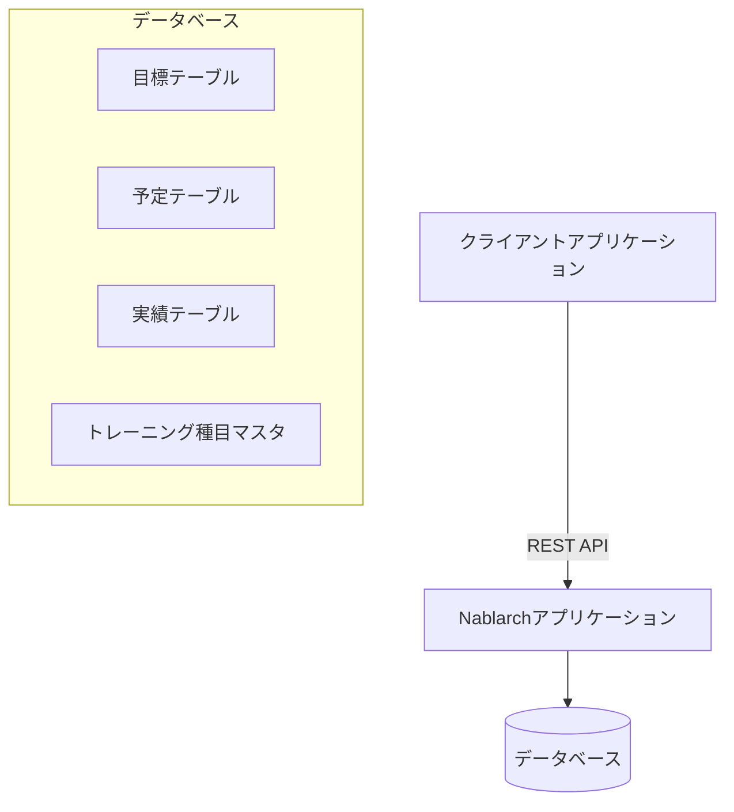

# トレーニング管理システム実装ガイド

## はじめに

このガイドは、Nablarchフレームワークを使用してRESTful APIを実装する実践的な学習教材です。トレーニング管理システムの開発を通じて、エンタープライズJavaアプリケーション開発の基礎を学びます。

### 学習の目的

このガイドでは以下の知識とスキルを習得することができます：

1. **Nablarchフレームワークの基礎**
   - RESTfulウェブサービスの実装方法
   - データベースアクセスの実装
   - バリデーションの実装
   - セキュリティ対策の実装

2. **エンタープライズアプリケーション開発スキル**
   - レイヤード・アーキテクチャの実践
   - データモデリングとテーブル設計
   - APIエンドポイントの設計
   - テストの実装

3. **実務で必要となる周辺知識**
   - プロジェクト構成管理
   - ビルドとデプロイメント
   - 運用監視の設定
   - API仕様書の作成

### 学習の進め方

1. **環境構築フェーズ**
   - Nablarchの基本概念の理解
   - 開発環境のセットアップ
   - プロジェクトの初期化

2. **基本実装フェーズ**
   - データベーススキーマの作成
   - 基本的なCRUD操作の実装
   - 単体テストの作成

3. **応用実装フェーズ**
   - バリデーションの追加
   - セキュリティ機能の実装
   - 結合テストの作成

4. **運用準備フェーズ**
   - API仕様書の作成
   - 運用監視の設定
   - デプロイ手順の確認

各フェーズで作成したコードやドキュメントは、実際の業務でも応用できる実践的なものとなっています。

## 1. システム概要

このシステムは、筋トレの目標設定、スケジュール管理、実績記録を行うRESTful APIを提供します。Nablarchフレームワークを使用して実装します。

## 2. システム構成



## 3. データモデル

### 3.1 トレーニング種目（exercises）
```sql
CREATE TABLE exercises (
    exercise_id SERIAL PRIMARY KEY,
    name VARCHAR(100) NOT NULL,
    category VARCHAR(50) NOT NULL,
    description TEXT,
    created_at TIMESTAMP NOT NULL DEFAULT CURRENT_TIMESTAMP,
    updated_at TIMESTAMP NOT NULL DEFAULT CURRENT_TIMESTAMP
);
```

### 3.2 目標（goals）
```sql
CREATE TABLE goals (
    goal_id SERIAL PRIMARY KEY,
    user_id VARCHAR(100) NOT NULL,
    exercise_id INTEGER REFERENCES exercises(exercise_id),
    target_weight DECIMAL(5,2),
    target_reps INTEGER,
    target_sets INTEGER,
    start_date DATE NOT NULL,
    end_date DATE NOT NULL,
    status VARCHAR(20) NOT NULL,
    created_at TIMESTAMP NOT NULL DEFAULT CURRENT_TIMESTAMP,
    updated_at TIMESTAMP NOT NULL DEFAULT CURRENT_TIMESTAMP
);
```

### 3.3 トレーニング予定（schedules）
```sql
CREATE TABLE schedules (
    schedule_id SERIAL PRIMARY KEY,
    user_id VARCHAR(100) NOT NULL,
    training_date DATE NOT NULL,
    exercise_id INTEGER REFERENCES exercises(exercise_id),
    planned_weight DECIMAL(5,2),
    planned_reps INTEGER,
    planned_sets INTEGER,
    note TEXT,
    created_at TIMESTAMP NOT NULL DEFAULT CURRENT_TIMESTAMP,
    updated_at TIMESTAMP NOT NULL DEFAULT CURRENT_TIMESTAMP
);
```

### 3.4 トレーニング実績（results）
```sql
CREATE TABLE results (
    result_id SERIAL PRIMARY KEY,
    schedule_id INTEGER REFERENCES schedules(schedule_id),
    user_id VARCHAR(100) NOT NULL,
    exercise_id INTEGER REFERENCES exercises(exercise_id),
    actual_weight DECIMAL(5,2),
    actual_reps INTEGER,
    actual_sets INTEGER,
    completed_at TIMESTAMP NOT NULL,
    feeling INTEGER CHECK (feeling BETWEEN 1 AND 5),
    note TEXT,
    created_at TIMESTAMP NOT NULL DEFAULT CURRENT_TIMESTAMP,
    updated_at TIMESTAMP NOT NULL DEFAULT CURRENT_TIMESTAMP
);
```

## 4. API エンドポイント

### 4.1 トレーニング種目管理

- `GET /api/exercises` - 種目一覧の取得
- `GET /api/exercises/{exerciseId}` - 種目詳細の取得
- `POST /api/exercises` - 新規種目の登録
- `PUT /api/exercises/{exerciseId}` - 種目情報の更新
- `DELETE /api/exercises/{exerciseId}` - 種目の削除

### 4.2 目標管理

- `GET /api/goals` - 目標一覧の取得
- `GET /api/goals/{goalId}` - 目標詳細の取得
- `POST /api/goals` - 新規目標の設定
- `PUT /api/goals/{goalId}` - 目標の更新
- `DELETE /api/goals/{goalId}` - 目標の削除

### 4.3 スケジュール管理

- `GET /api/schedules` - スケジュール一覧の取得
- `GET /api/schedules/{scheduleId}` - スケジュール詳細の取得
- `POST /api/schedules` - 新規スケジュールの登録
- `PUT /api/schedules/{scheduleId}` - スケジュールの更新
- `DELETE /api/schedules/{scheduleId}` - スケジュールの削除

### 4.4 実績管理

- `GET /api/results` - 実績一覧の取得
- `GET /api/results/{resultId}` - 実績詳細の取得
- `POST /api/results` - 新規実績の記録
- `PUT /api/results/{resultId}` - 実績の更新
- `DELETE /api/results/{resultId}` - 実績の削除

## 5. 実装手順

### 5.1 プロジェクトのセットアップ

1. Nablarchのブランクプロジェクトを作成
```bash
mvn org.apache.maven.plugins:maven-archetype-plugin:2.4:generate \
    -DarchetypeGroupId=com.nablarch.archetype \
    -DarchetypeArtifactId=nablarch-rest-service-archetype \
    -DarchetypeVersion=5u18 \
    -DgroupId=com.example \
    -DartifactId=training-management-api \
    -Dversion=0.1.0
```

2. プロジェクト設定の確認と調整
   - `pom.xml`の依存関係
   - データベース設定
   - 環境設定ファイル

### 5.2 データベースのセットアップ

1. データベースの作成
2. テーブル定義の実行
3. 初期データの投入（必要な場合）

### 5.3 Action クラスの実装

各エンドポイントに対応するActionクラスを作成します。

例）トレーニング種目の取得API：
```java
@Controller
@RequestMapping("/api/exercises")
public class ExerciseAction {

    @InjectForm(form = ExerciseSearchForm.class)
    public HttpResponse list(HttpRequest request) {
        ExerciseSearchForm form = context.getRequestScopedVar("form");
        
        List<Exercise> exercises = UniversalDao.findAll(Exercise.class);
        
        return new JsonResponse(exercises);
    }

    @RequestMapping("/{exerciseId}")
    public HttpResponse get(HttpRequest request) {
        String exerciseId = request.getParam("exerciseId")[0];
        
        Exercise exercise = UniversalDao.findById(Exercise.class, exerciseId);
        
        return new JsonResponse(exercise);
    }
}
```

### 5.4 Form クラスの実装

リクエストパラメータのバリデーションを行うFormクラスを実装します。

例）トレーニング種目登録用Form：
```java
public class ExerciseForm {

    @Required
    @Length(max = 100)
    private String name;

    @Required
    @Length(max = 50)
    private String category;

    @Length(max = 1000)
    private String description;

    // getter/setterメソッド
}
```

### 5.5 エンティティクラスの実装

データベースのテーブルに対応するエンティティクラスを実装します。

例）トレーニング種目エンティティ：
```java
@Entity
@Table(name = "exercises")
public class Exercise {

    @Id
    @Column(name = "exercise_id")
    private Long exerciseId;

    @Column(name = "name", nullable = false)
    private String name;

    @Column(name = "category", nullable = false)
    private String category;

    @Column(name = "description")
    private String description;

    // getter/setterメソッド
}
```

### 5.6 テストの実装

1. 単体テスト
   - Formクラスのバリデーションテスト
   - Actionクラスのテスト
   - エンティティクラスのテスト

2. 結合テスト
   - APIエンドポイントの結合テスト
   - データベースアクセスのテスト

例）トレーニング種目取得APIのテスト：
```java
public class ExerciseActionTest {

    @Test
    public void testList() {
        HttpResponse response = new ExerciseAction().list(new MockHttpRequest());
        
        assertThat(response.getStatusCode(), is(200));
        // レスポンスの検証
    }
}
```

## 6. セキュリティ対策

1. 認証・認可の実装
   - Bearer トークン認証の実装
   - ユーザーごとのデータアクセス制御

2. 入力値のバリデーション
   - XSS対策
   - SQLインジェクション対策

3. CORS設定
   - 許可するオリジンの設定
   - プリフライトリクエストの処理

## 7. 運用・監視

1. ログ出力の設定
   - アクセスログ
   - エラーログ
   - 監査ログ

2. パフォーマンスモニタリング
   - レスポンス時間の監視
   - リソース使用状況の監視

## 8. デプロイメント

1. ビルド
```bash
mvn clean package
```

2. デプロイ
   - アプリケーションサーバーの選択と設定
   - デプロイ手順の文書化
   - 環境別設定の管理

## 9. API ドキュメント

OpenAPI（Swagger）を使用してAPI仕様書を作成します。

```yaml
openapi: 3.0.0
info:
  title: トレーニング管理API
  version: 1.0.0
paths:
  /api/exercises:
    get:
      summary: トレーニング種目一覧の取得
      responses:
        '200':
          description: 成功
          content:
            application/json:
              schema:
                type: array
                items:
                  $ref: '#/components/schemas/Exercise'
```

## 10. 今後の拡張性

1. 機能拡張の検討
   - トレーニング履歴の分析機能
   - 目標達成度の可視化
   - トレーニングプランの自動生成

2. パフォーマンス最適化
   - キャッシュの導入
   - クエリの最適化
   - インデックス設計の見直し

## 11. 参考リンク

### 公式ドキュメント
- [Nablarchドキュメント](https://nablarch.github.io/docs/LATEST/doc/)
- [アプリケーションフレームワーム解説書](https://nablarch.github.io/docs/LATEST/doc/application_framework/application_framework/index.html)
- [RESTfulウェブサービス編](https://nablarch.github.io/docs/LATEST/doc/application_framework/application_framework/web_service/rest/index.html)

### 開発環境セットアップ
- [初期セットアップの前に](https://nablarch.github.io/docs/LATEST/doc/application_framework/application_framework/blank_project/beforeFirstStep.html)
- [初期セットアップ手順](https://nablarch.github.io/docs/LATEST/doc/application_framework/application_framework/blank_project/FirstStep.html)
- [Maven アーキタイプのセットアップ](https://nablarch.github.io/docs/LATEST/doc/application_framework/application_framework/blank_project/maven.html)

### APIリファレンス
- [Nablarch API リファレンス](https://nablarch.github.io/docs/LATEST/javadoc/index.html)
- [モジュール一覧](https://nablarch.github.io/docs/LATEST/doc/about_nablarch/mvn_module.html)

### チュートリアルとサンプル
- [Getting Started（RESTful Web サービス編）](https://nablarch.github.io/docs/LATEST/doc/application_framework/application_framework/web_service/rest/getting_started/index.html)
- [サンプルプロジェクト](https://github.com/nablarch/nablarch-example-rest)

### 設定ガイド
- [Nablarchアプリケーションフレームワーク設定ガイド](https://nablarch.github.io/docs/LATEST/doc/application_framework/application_framework/setting_guide/index.html)
- [デフォルト設定一覧](https://nablarch.github.io/docs/LATEST/doc/application_framework/application_framework/configuration/index.html)
