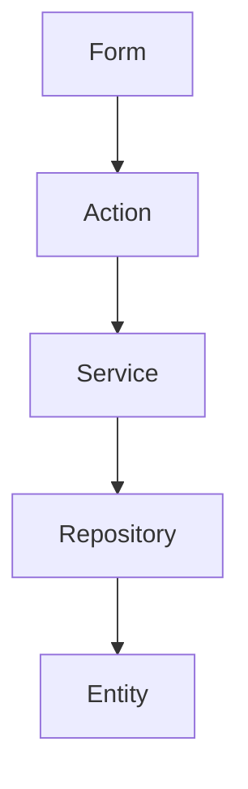

# 筋トレ管理システム 開発ガイド

## 目次
1. [環境構築](#環境構築)
2. [アプリケーション構造](#アプリケーション構造)
3. [実装例](#実装例)
4. [API仕様](#api仕様)

## 環境構築

### 前提条件
- JDK 8以上
- Maven 3.x
- PostgreSQL（または他のRDBMS）

### セットアップ手順
1. [Nablarchのセットアップガイド](https://nablarch.github.io/docs/LATEST/doc/application_framework/application_framework/blank_project/FirstStep.html)に従って、プロジェクトを作成してください。
2. [RESTfulウェブサービス編](https://nablarch.github.io/docs/LATEST/doc/application_framework/application_framework/web_service/rest/index.html)を参照し、REST API用の設定を行ってください。

## アプリケーション構造

### レイヤー構成



各レイヤーの責務は以下の通りです：

- **Action**: リクエストの受付、バリデーション、レスポンス生成
- **Form**: リクエストデータの保持、バリデーション定義
- **Service**: ビジネスロジックの実装
- **Repository**: データアクセス処理の実装
- **Entity**: データモデルの定義

### リクエスト/レスポンスの流れ

1. クライアントからのリクエストをActionが受け付ける
2. Formクラスでリクエストデータをバリデーション
3. Serviceクラスでビジネスロジックを実行
4. Repositoryクラスでデータアクセスを実行
5. 処理結果をJSON形式でレスポンス

## 実装例

### エンティティ定義

```java
package com.example.training.entity;

import javax.persistence.Column;
import javax.persistence.Entity;
import javax.persistence.Id;
import javax.persistence.Table;
import java.time.LocalDate;

@Entity
@Table(name = "goals")
public class Goal {
    @Id
    @Column(name = "id")
    private Long id;

    @Column(name = "target_muscle")
    private String targetMuscle;

    @Column(name = "target_weight")
    private Integer targetWeight;

    @Column(name = "target_reps")
    private Integer targetReps;

    @Column(name = "target_date")
    private LocalDate targetDate;

    // Getter/Setter
    public Long getId() {
        return id;
    }

    public void setId(Long id) {
        this.id = id;
    }

    public String getTargetMuscle() {
        return targetMuscle;
    }

    public void setTargetMuscle(String targetMuscle) {
        this.targetMuscle = targetMuscle;
    }

    public Integer getTargetWeight() {
        return targetWeight;
    }

    public void setTargetWeight(Integer targetWeight) {
        this.targetWeight = targetWeight;
    }

    public Integer getTargetReps() {
        return targetReps;
    }

    public void setTargetReps(Integer targetReps) {
        this.targetReps = targetReps;
    }

    public LocalDate getTargetDate() {
        return targetDate;
    }

    public void setTargetDate(LocalDate targetDate) {
        this.targetDate = targetDate;
    }
}
```

### フォームクラス

```java
package com.example.training.form;

import nablarch.core.validation.ee.Domain;
import nablarch.core.validation.ee.Required;

public class GoalForm {
    @Required
    @Domain("targetMuscle")
    private String targetMuscle;

    @Required
    @Domain("targetWeight")
    private Integer targetWeight;

    @Required
    @Domain("targetReps")
    private Integer targetReps;

    @Required
    @Domain("targetDate")
    private String targetDate;

    // Getter/Setter
    public String getTargetMuscle() {
        return targetMuscle;
    }

    public void setTargetMuscle(String targetMuscle) {
        this.targetMuscle = targetMuscle;
    }

    public Integer getTargetWeight() {
        return targetWeight;
    }

    public void setTargetWeight(Integer targetWeight) {
        this.targetWeight = targetWeight;
    }

    public Integer getTargetReps() {
        return targetReps;
    }

    public void setTargetReps(Integer targetReps) {
        this.targetReps = targetReps;
    }

    public String getTargetDate() {
        return targetDate;
    }

    public void setTargetDate(String targetDate) {
        this.targetDate = targetDate;
    }
}
```

### リポジトリ実装

```java
package com.example.training.repository;

import com.example.training.entity.Goal;
import nablarch.common.dao.EntityList;
import nablarch.common.dao.UniversalDao;
import org.springframework.stereotype.Repository;

@Repository
public class GoalRepository {
    
    public Goal find(Long id) {
        return UniversalDao.findById(Goal.class, id);
    }
    
    public EntityList<Goal> findAll() {
        return UniversalDao.findAll(Goal.class);
    }
    
    public void create(Goal goal) {
        UniversalDao.insert(goal);
    }
    
    public void update(Goal goal) {
        UniversalDao.update(goal);
    }
}
```

### サービス実装

```java
package com.example.training.service;

import com.example.training.entity.Goal;
import com.example.training.repository.GoalRepository;
import nablarch.common.dao.EntityList;
import org.springframework.stereotype.Service;
import org.springframework.transaction.annotation.Transactional;

@Service
public class GoalService {
    
    private final GoalRepository goalRepository;
    
    public GoalService(GoalRepository goalRepository) {
        this.goalRepository = goalRepository;
    }
    
    public Goal findGoal(Long id) {
        return goalRepository.find(id);
    }
    
    public EntityList<Goal> findAllGoals() {
        return goalRepository.findAll();
    }
    
    @Transactional
    public void createGoal(Goal goal) {
        goalRepository.create(goal);
    }
}
```

### アクション実装

```java
package com.example.training.action;

import com.example.training.entity.Goal;
import com.example.training.form.GoalForm;
import com.example.training.service.GoalService;
import nablarch.common.dao.EntityList;
import nablarch.core.beans.BeanUtil;
import nablarch.fw.ExecutionContext;
import nablarch.fw.web.HttpRequest;
import nablarch.fw.web.HttpResponse;

public class GoalAction {
    
    private final GoalService goalService;
    
    public GoalAction(GoalService goalService) {
        this.goalService = goalService;
    }
    
    public HttpResponse list(HttpRequest request, ExecutionContext context) {
        EntityList<Goal> goals = goalService.findAllGoals();
        return new HttpResponse(200).write(goals);
    }
    
    public HttpResponse get(HttpRequest request, ExecutionContext context) {
        Long id = Long.parseLong(request.getParam("id")[0]);
        Goal goal = goalService.findGoal(id);
        return new HttpResponse(200).write(goal);
    }
    
    public HttpResponse create(HttpRequest request, ExecutionContext context) {
        GoalForm form = BeanUtil.createAndCopy(GoalForm.class, request.getParamMap());
        Goal goal = BeanUtil.createAndCopy(Goal.class, form);
        goalService.createGoal(goal);
        return new HttpResponse(201);
    }
}
```

### テスト実装

```java
package com.example.training.action;

import com.example.training.entity.Goal;
import com.example.training.service.GoalService;
import nablarch.fw.web.HttpResponse;
import nablarch.test.core.http.SimpleHttpRequestBuilder;
import nablarch.test.junit5.extension.NonAutoDetectEventListenerExtension;
import org.junit.jupiter.api.Test;
import org.junit.jupiter.api.extension.ExtendWith;

import static org.junit.jupiter.api.Assertions.assertEquals;

@ExtendWith(NonAutoDetectEventListenerExtension.class)
public class GoalActionTest {
    
    private final GoalService goalService = new GoalService(/* repository */);
    private final GoalAction action = new GoalAction(goalService);
    
    @Test
    void testCreate() {
        SimpleHttpRequestBuilder builder = new SimpleHttpRequestBuilder();
        builder.setParam("targetMuscle", "大胸筋");
        builder.setParam("targetWeight", "80");
        builder.setParam("targetReps", "10");
        builder.setParam("targetDate", "2024-12-31");
        
        HttpResponse response = action.create(builder.build(), null);
        assertEquals(201, response.getStatusCode());
    }
}
```

## API仕様

### 目標一覧取得 API

- **エンドポイント**: GET /api/v1/goals
- **レスポンス例**:
```json
{
  "goals": [
    {
      "id": 1,
      "targetMuscle": "大胸筋",
      "targetWeight": 80,
      "targetReps": 10,
      "targetDate": "2024-12-31"
    }
  ]
}
```

### 目標設定 API

- **エンドポイント**: POST /api/v1/goals
- **リクエスト例**:
```json
{
  "targetMuscle": "大胸筋",
  "targetWeight": 80,
  "targetReps": 10,
  "targetDate": "2024-12-31"
}
```
- **レスポンス**: 201 Created

### 目標詳細取得 API

- **エンドポイント**: GET /api/v1/goals/{id}
- **レスポンス例**:
```json
{
  "id": 1,
  "targetMuscle": "大胸筋",
  "targetWeight": 80,
  "targetReps": 10,
  "targetDate": "2024-12-31"
}
```
