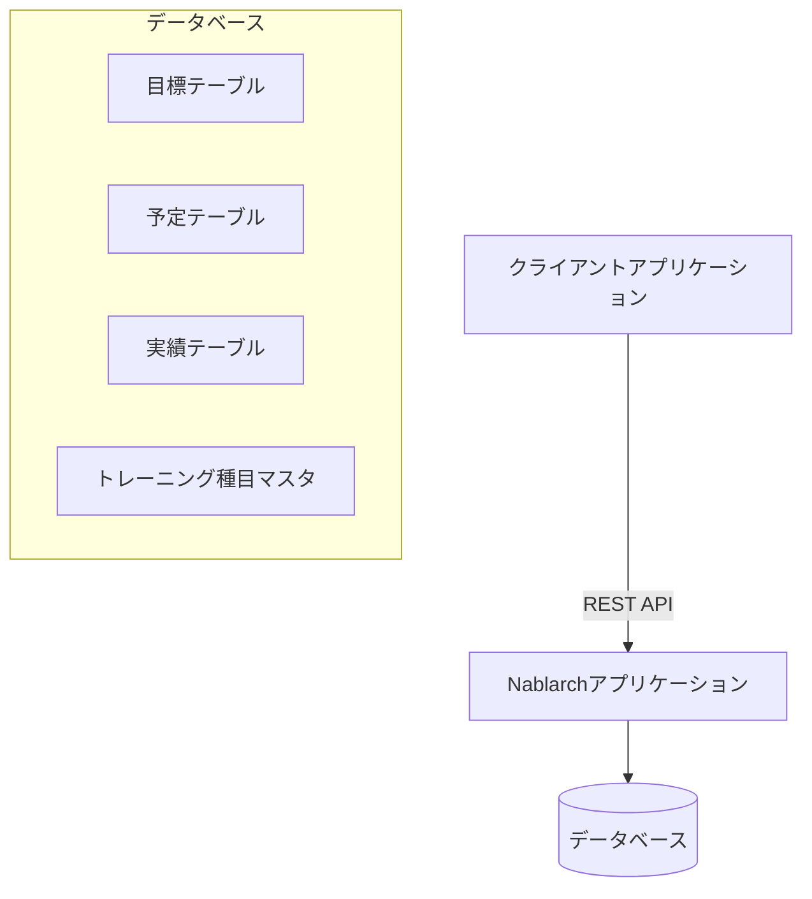

**User:**

<task>
MCPのFirecrawlツールを使って、以下のサイトの概要を把握してください。

https://nablarch.github.io/docs/LATEST/doc/
</task>
<environment_details>
# VSCode Visible Files
work-log/cline_task_apr-10-2025_7-23-41-am.md

# VSCode Open Tabs
TrainingManagementGuide.md
work-log/cline_task_apr-10-2025_7-23-41-am.md

# Current Time
4/10/2025, 7:37:20 AM (Asia/Tokyo, UTC+9:00)

# Current Working Directory (/Users/akiraabe/practice/nablarch-study) Files
LLMs.md
TrainingManagementGuide.md
memory-bank/
memory-bank/.clinerules
memory-bank/activeContext.md
memory-bank/productContext.md
memory-bank/progress.md
memory-bank/projectbrief.md
memory-bank/systemPatterns.md
memory-bank/techContext.md
work-log/
work-log/cline_task_apr-10-2025_7-23-41-am.md
# Context Window Usage
0 / 128K tokens used (0%)

# Current Mode
PLAN MODE
In this mode you should focus on information gathering, asking questions, and architecting a solution. Once you have a plan, use the plan_mode_respond tool to engage in a conversational back and forth with the user. Do not use the plan_mode_respond tool until you've gathered all the information you need e.g. with read_file or ask_followup_question.
(Remember: If it seems the user wants you to use tools only available in Act Mode, you should ask the user to "toggle to Act mode" (use those words) - they will have to manually do this themselves with the Plan/Act toggle button below. You do not have the ability to switch to Act Mode yourself, and must wait for the user to do it themselves once they are satisfied with the plan. You also cannot present an option to toggle to Act mode, as this will be something you need to direct the user to do manually themselves.)
</environment_details>

---

**Assistant:**

<thinking>
メモリーバンクをまず確認する必要があります。Nablarchに関する既存の文脈を理解するために、全てのメモリーバンクファイルを読み込みます。

1. まずprojectbrief.mdから読み始めましょう。
</thinking>

<read_file>
<path>memory-bank/projectbrief.md</path>
</read_file>

---

**User:**

[read_file for 'memory-bank/projectbrief.md'] Result:
# Project Brief: Nablarch Study

## Overview
This project is dedicated to studying and understanding the Nablarch application framework, a Java-based enterprise application framework developed in Japan. The goal is to learn its architecture, features, and best practices through practical examples and exercises.

## Core Requirements
- Learn Nablarch framework fundamentals
- Understand Nablarch architecture and design patterns
- Practice building applications using Nablarch
- Document learning progress and insights
- Create example applications for learning purposes

## Project Goals
1. Master Nablarch framework concepts
2. Understand enterprise Java application development patterns
3. Build practical knowledge through hands-on examples
4. Create reference implementations for learning
5. Document best practices and learnings

## Success Criteria
- Ability to build basic applications using Nablarch
- Understanding of Nablarch's core features and patterns
- Clear documentation of learning progress
- Practical examples demonstrating framework usage
- Working knowledge of enterprise Java development patterns

## Scope
- Focus on Nablarch framework components
- Java-based application development
- Enterprise application patterns
- Testing and quality assurance
- Documentation and knowledge sharing

## Out of Scope
- Production deployment
- Performance optimization
- Security hardening
- Integration with external systems (unless required for learning)

<environment_details>
# VSCode Visible Files
work-log/cline_task_apr-10-2025_7-23-41-am.md

# VSCode Open Tabs
TrainingManagementGuide.md
work-log/cline_task_apr-10-2025_7-23-41-am.md

# Current Time
4/10/2025, 7:37:32 AM (Asia/Tokyo, UTC+9:00)
# Context Window Usage
28,067 / 81.638K tokens used (34%)

# Current Mode
PLAN MODE
In this mode you should focus on information gathering, asking questions, and architecting a solution. Once you have a plan, use the plan_mode_respond tool to engage in a conversational back and forth with the user. Do not use the plan_mode_respond tool until you've gathered all the information you need e.g. with read_file or ask_followup_question.
(Remember: If it seems the user wants you to use tools only available in Act Mode, you should ask the user to "toggle to Act mode" (use those words) - they will have to manually do this themselves with the Plan/Act toggle button below. You do not have the ability to switch to Act Mode yourself, and must wait for the user to do it themselves once they are satisfied with the plan. You also cannot present an option to toggle to Act mode, as this will be something you need to direct the user to do manually themselves.)
</environment_details>

---

**Assistant:**

<thinking>
続いて、productContext.mdを読んで、このプロジェクトの目的とコンテキストをより深く理解します。
</thinking>

<read_file>
<path>memory-bank/productContext.md</path>
</read_file>

---

**User:**

[read_file for 'memory-bank/productContext.md'] Result:
# Product Context: Nablarch Study

## Purpose
To provide a structured learning environment for understanding and mastering the Nablarch framework, enabling effective enterprise Java application development.

## Problems to Solve
1. Knowledge Gap
   - Limited English resources for Nablarch
   - Complex enterprise patterns understanding
   - Framework-specific concepts and patterns

2. Learning Curve
   - Enterprise Java complexity
   - Nablarch-specific architecture
   - Best practices implementation

3. Practical Application
   - Converting theory to practice
   - Real-world usage patterns
   - Testing and validation approaches

## Expected Workflow
1. Study Phase
   - Review documentation
   - Understand core concepts
   - Analyze example code

2. Practice Phase
   - Create sample applications
   - Implement different features
   - Test implementations

3. Documentation Phase
   - Record learnings
   - Document patterns
   - Share insights

## User Experience Goals
1. Clear Learning Path
   - Structured approach to learning
   - Progressive complexity
   - Practical examples

2. Knowledge Retention
   - Well-documented examples
   - Clear explanations
   - Reusable patterns

3. Practical Skills
   - Hands-on experience
   - Real-world applications
   - Best practices implementation

<environment_details>
# VSCode Visible Files
work-log/cline_task_apr-10-2025_7-23-41-am.md

# VSCode Open Tabs
TrainingManagementGuide.md
work-log/cline_task_apr-10-2025_7-23-41-am.md

# Current Time
4/10/2025, 7:37:37 AM (Asia/Tokyo, UTC+9:00)
# Context Window Usage
28,042 / 81.638K tokens used (34%)

# Current Mode
PLAN MODE
In this mode you should focus on information gathering, asking questions, and architecting a solution. Once you have a plan, use the plan_mode_respond tool to engage in a conversational back and forth with the user. Do not use the plan_mode_respond tool until you've gathered all the information you need e.g. with read_file or ask_followup_question.
(Remember: If it seems the user wants you to use tools only available in Act Mode, you should ask the user to "toggle to Act mode" (use those words) - they will have to manually do this themselves with the Plan/Act toggle button below. You do not have the ability to switch to Act Mode yourself, and must wait for the user to do it themselves once they are satisfied with the plan. You also cannot present an option to toggle to Act mode, as this will be something you need to direct the user to do manually themselves.)
</environment_details>

---

**Assistant:**

<thinking>
systemPatterns.mdを確認して、システムアーキテクチャと技術的な決定事項を理解します。
</thinking>

<read_file>
<path>memory-bank/systemPatterns.md</path>
</read_file>

---

**User:**

[read_file for 'memory-bank/systemPatterns.md'] Result:
# System Patterns: Nablarch Study

## Architecture Overview
The project will follow Nablarch's recommended architectural patterns and practices.

### Core Patterns
1. Layered Architecture
   - Presentation Layer
   - Business Logic Layer
   - Data Access Layer

2. Component Structure
   - Request/Response Pattern
   - Handlers Chain
   - Data Objects
   - Validation Components

### Design Patterns
1. Base Framework Patterns
   - System Repository Pattern
   - Database Access Delegation
   - Message Management
   - Configuration Management

2. Application Patterns
   - Form Processing
   - Database Access
   - Batch Processing
   - RESTful Services

## Technical Decisions
1. Development Approach
   - Test-Driven Development
   - Modular Design
   - Incremental Learning
   - Documentation-First

2. Implementation Strategy
   - Start with Basic Examples
   - Progress to Complex Features
   - Focus on Core Components
   - Build Reusable Patterns

## Component Relationships
1. Framework Integration
   - Core Framework Components
   - Application Components
   - Custom Extensions
   - Testing Components

2. Data Flow
   - Request Processing
   - Business Logic
   - Data Access
   - Response Generation

<environment_details>
# VSCode Visible Files
work-log/cline_task_apr-10-2025_7-23-41-am.md

# VSCode Open Tabs
TrainingManagementGuide.md
work-log/cline_task_apr-10-2025_7-23-41-am.md

# Current Time
4/10/2025, 7:37:44 AM (Asia/Tokyo, UTC+9:00)
# Context Window Usage
28,048 / 81.638K tokens used (34%)

# Current Mode
PLAN MODE
In this mode you should focus on information gathering, asking questions, and architecting a solution. Once you have a plan, use the plan_mode_respond tool to engage in a conversational back and forth with the user. Do not use the plan_mode_respond tool until you've gathered all the information you need e.g. with read_file or ask_followup_question.
(Remember: If it seems the user wants you to use tools only available in Act Mode, you should ask the user to "toggle to Act mode" (use those words) - they will have to manually do this themselves with the Plan/Act toggle button below. You do not have the ability to switch to Act Mode yourself, and must wait for the user to do it themselves once they are satisfied with the plan. You also cannot present an option to toggle to Act mode, as this will be something you need to direct the user to do manually themselves.)
</environment_details>

---

**Assistant:**

<thinking>
techContext.mdを読んで、使用している技術やセットアップ、技術的な制約について理解を深めます。
</thinking>

<read_file>
<path>memory-bank/techContext.md</path>
</read_file>

---

**User:**

[read_file for 'memory-bank/techContext.md'] Result:
# Technical Context: Nablarch Study

## Technologies Used
1. Core Technologies
   - Java 8+
   - Nablarch Framework
   - Maven/Gradle (Build Tools)
   - SQL Database (H2/PostgreSQL)

2. Development Tools
   - IDE (Eclipse/IntelliJ IDEA)
   - Git (Version Control)
   - JUnit (Testing)
   - Maven/Gradle Plugins

## Development Setup
1. Environment Requirements
   - JDK 8 or higher
   - Maven 3.x or Gradle
   - Git
   - IDE with Java support
   - Database tools

2. Project Structure
   - Maven/Gradle standard layout
   - Nablarch application structure
   - Test directories
   - Resource directories

## Technical Constraints
1. Framework Constraints
   - Nablarch version compatibility
   - Java version requirements
   - Database compatibility
   - Framework conventions

2. Development Constraints
   - Learning curve considerations
   - Documentation requirements
   - Testing requirements
   - Code quality standards

## Dependencies
1. Core Dependencies
   - Nablarch Framework Modules
   - Database Drivers
   - Testing Libraries
   - Logging Framework

2. Optional Dependencies
   - Code Analysis Tools
   - Documentation Tools
   - Build Plugins
   - Development Utilities

## Configuration Management
1. Build Configuration
   - Maven/Gradle setup
   - Dependency management
   - Build profiles
   - Resource filtering

2. Application Configuration
   - Properties files
   - Environment settings
   - Logging configuration
   - Database settings

<environment_details>
# VSCode Visible Files
work-log/cline_task_apr-10-2025_7-23-41-am.md

# VSCode Open Tabs
TrainingManagementGuide.md
work-log/cline_task_apr-10-2025_7-23-41-am.md

# Current Time
4/10/2025, 7:37:51 AM (Asia/Tokyo, UTC+9:00)
# Context Window Usage
28,057 / 81.638K tokens used (34%)

# Current Mode
PLAN MODE
In this mode you should focus on information gathering, asking questions, and architecting a solution. Once you have a plan, use the plan_mode_respond tool to engage in a conversational back and forth with the user. Do not use the plan_mode_respond tool until you've gathered all the information you need e.g. with read_file or ask_followup_question.
(Remember: If it seems the user wants you to use tools only available in Act Mode, you should ask the user to "toggle to Act mode" (use those words) - they will have to manually do this themselves with the Plan/Act toggle button below. You do not have the ability to switch to Act Mode yourself, and must wait for the user to do it themselves once they are satisfied with the plan. You also cannot present an option to toggle to Act mode, as this will be something you need to direct the user to do manually themselves.)
</environment_details>

---

**Assistant:**

<thinking>
activeContext.mdを読んで、現在の作業の焦点と最近の変更、次のステップについて理解します。
</thinking>

<read_file>
<path>memory-bank/activeContext.md</path>
</read_file>

---

**User:**

[read_file for 'memory-bank/activeContext.md'] Result:
# Active Context: Nablarch Study

## Current Focus
1. Project Initialization
   - Setting up memory bank structure
   - Documenting initial context
   - Establishing project foundations

2. Learning Path Planning
   - Identifying key learning areas
   - Structuring study approach
   - Planning example implementations

## Recent Changes
1. Project Setup
   - Created memory bank structure
   - Initialized core documentation
   - Established project scope

2. Documentation
   - Created Project Brief
   - Defined Product Context
   - Documented System Patterns
   - Specified Technical Context

## Next Steps
1. Immediate Tasks
   - Set up development environment
   - Install required dependencies
   - Create initial example project

2. Short-term Goals
   - Study basic Nablarch concepts
   - Create simple application example
   - Document initial learnings

3. Medium-term Goals
   - Implement core patterns
   - Build more complex examples
   - Expand documentation

## Active Decisions
1. Development Environment
   - Tool selection pending
   - Framework version to be determined
   - Database choice to be made

2. Learning Strategy
   - Start with basic concepts
   - Focus on practical examples
   - Document learnings consistently

## Current Considerations
1. Technical Setup
   - Development environment requirements
   - Framework compatibility
   - Tool integration needs

2. Learning Approach
   - Resource availability
   - Learning sequence
   - Practice project scope

<environment_details>
# VSCode Visible Files
work-log/cline_task_apr-10-2025_7-23-41-am.md

# VSCode Open Tabs
TrainingManagementGuide.md
work-log/cline_task_apr-10-2025_7-23-41-am.md

# Current Time
4/10/2025, 7:37:58 AM (Asia/Tokyo, UTC+9:00)
# Context Window Usage
28,061 / 81.638K tokens used (34%)

# Current Mode
PLAN MODE
In this mode you should focus on information gathering, asking questions, and architecting a solution. Once you have a plan, use the plan_mode_respond tool to engage in a conversational back and forth with the user. Do not use the plan_mode_respond tool until you've gathered all the information you need e.g. with read_file or ask_followup_question.
(Remember: If it seems the user wants you to use tools only available in Act Mode, you should ask the user to "toggle to Act mode" (use those words) - they will have to manually do this themselves with the Plan/Act toggle button below. You do not have the ability to switch to Act Mode yourself, and must wait for the user to do it themselves once they are satisfied with the plan. You also cannot present an option to toggle to Act mode, as this will be something you need to direct the user to do manually themselves.)
</environment_details>

---

**Assistant:**

<thinking>
最後にprogress.mdを読んで、現在の進捗状況と残りのタスクを確認します。
</thinking>

<read_file>
<path>memory-bank/progress.md</path>
</read_file>

---

**User:**

[read_file for 'memory-bank/progress.md'] Result:
# Progress: Nablarch Study

## What Works
1. Project Structure
   - Memory bank initialized
   - Core documentation created
   - Project scope defined

2. Documentation
   - Project brief completed
   - Product context documented
   - System patterns outlined
   - Technical context specified
   - Active context established

## What's Left to Build
1. Development Environment
   - Java development setup
   - Nablarch framework installation
   - Database configuration
   - IDE setup and configuration

2. Learning Materials
   - Basic concept tutorials
   - Example applications
   - Practice exercises
   - Code templates

3. Documentation Expansion
   - Detailed architecture docs
   - Implementation guides
   - Best practices documentation
   - Troubleshooting guides

## Current Status
1. Project Initialization
   - Status: In Progress
   - Phase: Documentation Setup
   - Next: Development Environment Setup

2. Documentation Status
   - Core files: Complete
   - Learning materials: Not Started
   - Example code: Not Started
   - Best practices: Not Started

## Known Issues
1. Setup Requirements
   - Development environment not configured
   - Framework version not selected
   - Database choice pending

2. Documentation Gaps
   - Detailed implementation guides needed
   - Example code documentation pending
   - Best practices documentation required

## Upcoming Work
1. Environment Setup
   - Install Java Development Kit
   - Configure build tools
   - Set up database
   - Configure IDE

2. Initial Learning
   - Study core concepts
   - Review documentation
   - Create basic examples
   - Document learnings

<environment_details>
# VSCode Visible Files
work-log/cline_task_apr-10-2025_7-23-41-am.md

# VSCode Open Tabs
TrainingManagementGuide.md
work-log/cline_task_apr-10-2025_7-23-41-am.md

# Current Time
4/10/2025, 7:38:07 AM (Asia/Tokyo, UTC+9:00)
# Context Window Usage
28,064 / 81.638K tokens used (34%)

# Current Mode
PLAN MODE
In this mode you should focus on information gathering, asking questions, and architecting a solution. Once you have a plan, use the plan_mode_respond tool to engage in a conversational back and forth with the user. Do not use the plan_mode_respond tool until you've gathered all the information you need e.g. with read_file or ask_followup_question.
(Remember: If it seems the user wants you to use tools only available in Act Mode, you should ask the user to "toggle to Act mode" (use those words) - they will have to manually do this themselves with the Plan/Act toggle button below. You do not have the ability to switch to Act Mode yourself, and must wait for the user to do it themselves once they are satisfied with the plan. You also cannot present an option to toggle to Act mode, as this will be something you need to direct the user to do manually themselves.)
</environment_details>

---

**Assistant:**

<thinking>
メモリーバンクの内容を確認した上で、以下のことが分かりました：

1. このプロジェクトはNablarchフレームワークの学習が目的
2. 現在は初期段階で、開発環境のセットアップや基本概念の学習を始めようとしている状態
3. ドキュメントの整備は進んでいるが、実践的な学習はこれから

Firecrawlツールを使ってNablarchの公式ドキュメントをスクレイピングし、基本的な情報を収集するプランを立てます。
</thinking>

<plan_mode_respond>
<response>
Nablarchの公式ドキュメントを効率的に分析するため、以下のような手順で進めていきたいと思います：

1. まず、Actモードに切り替えて以下の作業を行います：

   a. `firecrawl_scrape`を使用して、トップページの基本情報を取得
   b. `firecrawl_map`を使用して、サイト構造を把握
   c. 特に重要そうなページについて、再度`firecrawl_scrape`で詳細な情報を取得

2. 収集した情報を元に、以下の観点で整理します：
   - Nablarchの概要と特徴
   - アーキテクチャの基本構造
   - 主要なコンポーネント
   - 開発環境のセットアップ方法

このアプローチでよろしいでしょうか？Actモードに切り替えていただければ、具体的な情報収集を開始できます。
</response>
</plan_mode_respond>

---

**User:**

[plan_mode_respond] Result:
[The user has switched to ACT MODE, so you may now proceed with the task.]
<environment_details>
# VSCode Visible Files
work-log/cline_task_apr-10-2025_7-23-41-am.md

# VSCode Open Tabs
TrainingManagementGuide.md
work-log/cline_task_apr-10-2025_7-23-41-am.md

# Current Time
4/10/2025, 7:38:35 AM (Asia/Tokyo, UTC+9:00)
# Context Window Usage
28,401 / 128K tokens used (22%)

# Current Mode
ACT MODE
</environment_details>

---

**Assistant:**

<thinking>
まず、トップページの内容を取得して基本的な情報を確認します。Firecrawlのscrapeツールを使用して、メインコンテンツを取得します。
</thinking>

<use_mcp_tool>
<server_name>github.com/mendableai/firecrawl-mcp-server</server_name>
<tool_name>firecrawl_scrape</tool_name>
<arguments>
{
  "url": "https://nablarch.github.io/docs/LATEST/doc/",
  "formats": ["markdown"],
  "onlyMainContent": true,
  "waitFor": 2000
}
</arguments>
</use_mcp_tool>

---

**User:**

[use_mcp_tool for 'github.com/mendableai/firecrawl-mcp-server'] Result:
- [Docs](https://nablarch.github.io/docs/LATEST/doc/#) »
- Nablarch
- [GitHub](https://github.com/nablarch)
- [English](https://nablarch.github.io/docs/LATEST/doc/en/index.html)

* * *

[](https://nablarch.github.io/docs/LATEST/doc/_images/Nablarch.jpg)

# Nablarch [¶](https://nablarch.github.io/docs/LATEST/doc/\#nablarch "このヘッドラインへのパーマリンク")

Nablarch(ナブラーク)は、TISの豊富な基幹システム構築経験から得られたナレッジを集約したJavaアプリケーション開発/実行基盤です。

## Nablarchについて [¶](https://nablarch.github.io/docs/LATEST/doc/\#id1 "このヘッドラインへのパーマリンク")

> [_コンセプト_](https://nablarch.github.io/docs/LATEST/doc/about_nablarch/concept.html)
>
> [_モジュール一覧_](https://nablarch.github.io/docs/LATEST/doc/about_nablarch/mvn_module.html)
>
> [_ライセンス_](https://nablarch.github.io/docs/LATEST/doc/about_nablarch/license.html)

## Nablarchアプリケーションフレームワーク [¶](https://nablarch.github.io/docs/LATEST/doc/\#id2 "このヘッドラインへのパーマリンク")

> [_解説書_](https://nablarch.github.io/docs/LATEST/doc/application_framework/application_framework/index.html)
>
> [_アダプタ_](https://nablarch.github.io/docs/LATEST/doc/application_framework/adaptors/index.html)

## Nablarch開発ツール [¶](https://nablarch.github.io/docs/LATEST/doc/\#id3 "このヘッドラインへのパーマリンク")

> [_効率的なJava静的チェック_](https://nablarch.github.io/docs/LATEST/doc/development_tools/java_static_analysis/index.html)
>
> [_テスティングフレームワーク_](https://nablarch.github.io/docs/LATEST/doc/development_tools/testing_framework/index.html)
>
> [_アプリケーション開発時に使える便利なツール_](https://nablarch.github.io/docs/LATEST/doc/development_tools/toolbox/index.html)

## Nablarchでの開発に役立つコンテンツ [¶](https://nablarch.github.io/docs/LATEST/doc/\#id4 "このヘッドラインへのパーマリンク")

[Fintan(外部サイト)](https://fintan.jp/) で公開している、Nablarchでの開発に役立つ [_コンテンツを紹介_](https://nablarch.github.io/docs/LATEST/doc/external_contents/index.html) しています。

> [Nablarchシステム開発ガイド](https://nablarch.github.io/docs/LATEST/doc/external_contents/index.html#system-development-guide)
>
> [開発標準](https://nablarch.github.io/docs/LATEST/doc/external_contents/index.html#development-standards)
<environment_details>
# VSCode Visible Files
work-log/cline_task_apr-10-2025_7-23-41-am.md

# VSCode Open Tabs
TrainingManagementGuide.md
work-log/cline_task_apr-10-2025_7-23-41-am.md

# Current Time
4/10/2025, 7:38:51 AM (Asia/Tokyo, UTC+9:00)
# Context Window Usage
28,160 / 81.638K tokens used (34%)

# Current Mode
ACT MODE
</environment_details>

---

**Assistant:**

<thinking>
サイトの構造をより詳しく把握するために、firecrawl_mapを使用してサイトマップを取得します。
</thinking>

<use_mcp_tool>
<server_name>github.com/mendableai/firecrawl-mcp-server</server_name>
<tool_name>firecrawl_map</tool_name>
<arguments>
{
  "url": "https://nablarch.github.io/docs/LATEST/doc/",
  "limit": 30
}
</arguments>
</use_mcp_tool>

---

**User:**

[use_mcp_tool for 'github.com/mendableai/firecrawl-mcp-server'] Result:
https://nablarch.github.io/docs/LATEST/doc/en
https://nablarch.github.io/docs/LATEST/doc/migration/index.html
https://nablarch.github.io/docs/LATEST/doc/about_nablarch/concept.html
https://nablarch.github.io/docs/LATEST/doc/inquiry/index.html
https://nablarch.github.io/docs/LATEST/doc/nablarch_api/index.html
https://nablarch.github.io/docs/LATEST/doc/jakarta_ee/index.html
https://nablarch.github.io/docs/LATEST/doc/application_framework/index.html
https://nablarch.github.io/docs/LATEST/doc/about_nablarch/mvn_module.html
https://nablarch.github.io/docs/LATEST/doc/examples/index.html
https://nablarch.github.io/docs/LATEST/doc/development_tools/index.html
https://nablarch.github.io/docs/LATEST/doc/about_nablarch/versionup_policy.html
https://nablarch.github.io/docs/LATEST/doc/releases/index.html
https://nablarch.github.io/docs/LATEST/doc/external_contents/index.html
https://nablarch.github.io/docs/LATEST/doc/about_nablarch/license.html
https://nablarch.github.io/docs/LATEST/doc/about_nablarch/index.html
https://nablarch.github.io/docs/LATEST/doc/application_framework/adaptors/mail_sender_velocity_adaptor.html
https://nablarch.github.io/docs/LATEST/doc/application_framework/application_framework/index.html
https://nablarch.github.io/docs/LATEST/doc/application_framework/adaptors/log_adaptor.html
https://nablarch.github.io/docs/LATEST/doc/application_framework/adaptors/lettuce_adaptor.html
https://nablarch.github.io/docs/LATEST/doc/biz_samples/05/index.html
https://nablarch.github.io/docs/LATEST/doc/biz_samples/13/index.html
https://nablarch.github.io/docs/LATEST/doc/application_framework/adaptors/doma_adaptor.html
https://nablarch.github.io/docs/LATEST/doc/application_framework/adaptors/mail_sender_freemarker_adaptor.html
https://nablarch.github.io/docs/LATEST/doc/application_framework/adaptors/jaxrs_adaptor.html
https://nablarch.github.io/docs/LATEST/doc/application_framework/adaptors/mail_sender_thymeleaf_adaptor.html
https://nablarch.github.io/docs/LATEST/doc/biz_samples/08/index.html
https://nablarch.github.io/docs/LATEST/doc/application_framework/adaptors/webspheremq_adaptor.html
https://nablarch.github.io/docs/LATEST/doc/en/about_nablarch/license.html
https://nablarch.github.io/docs/LATEST/doc/application_framework/adaptors/jsr310_adaptor.html
https://nablarch.github.io/docs/LATEST/doc/biz_samples/01/index.html
<environment_details>
# VSCode Visible Files
work-log/cline_task_apr-10-2025_7-23-41-am.md

# VSCode Open Tabs
TrainingManagementGuide.md
work-log/cline_task_apr-10-2025_7-23-41-am.md

# Current Time
4/10/2025, 7:39:12 AM (Asia/Tokyo, UTC+9:00)
# Context Window Usage
28,138 / 81.638K tokens used (34%)

# Current Mode
ACT MODE
</environment_details>

---

**Assistant:**

<thinking>
コンセプトページの内容を確認して、Nablarchの基本的な考え方と特徴を理解しましょう。
</thinking>

<use_mcp_tool>
<server_name>github.com/mendableai/firecrawl-mcp-server</server_name>
<tool_name>firecrawl_scrape</tool_name>
<arguments>
{
  "url": "https://nablarch.github.io/docs/LATEST/doc/about_nablarch/concept.html",
  "formats": ["markdown"],
  "onlyMainContent": true,
  "waitFor": 2000
}
</arguments>
</use_mcp_tool>

---

**User:**

[use_mcp_tool for 'github.com/mendableai/firecrawl-mcp-server'] Result:
- [Docs](https://nablarch.github.io/docs/LATEST/doc/index.html) »
- [Nablarchについて](https://nablarch.github.io/docs/LATEST/doc/about_nablarch/index.html) »
- Nablarchのコンセプト
- [GitHub](https://github.com/nablarch)
- [English](https://nablarch.github.io/docs/LATEST/doc/en/index.html)

* * *

# Nablarchのコンセプト [¶](https://nablarch.github.io/docs/LATEST/doc/about_nablarch/concept.html\#nablarch "このヘッドラインへのパーマリンク")

## Robustness [¶](https://nablarch.github.io/docs/LATEST/doc/about_nablarch/concept.html\#robustness "このヘッドラインへのパーマリンク")

Robustness(ロバストネス：堅牢性)とは、環境の変化、外部からの攻撃、内部のエラーといった様々な変動に対し、ダメージや損失を最小限にとどめ、機能を維持し続けることができる能力のことです。
Nablarchでは、このロバストネスという言葉に、障害に強いという意味やセキュリティ的に強固であるという意味の他に、長期間使い続けられるという意味も込めています。
このロバストネスの特性により、企業情報システムのアプリケーション開発・実行基盤として、長期間安心してご利用いただくことができます。

## Testability [¶](https://nablarch.github.io/docs/LATEST/doc/about_nablarch/concept.html\#testability "このヘッドラインへのパーマリンク")

基幹システムをはじめとする企業情報システムには高い信頼性が要求され、開発時には様々なテストを実施しなくてはなりません。
Nablarchはテスタビリティ（テスト容易性）を重視して設計しており、各種ドライバ、モック、自動テストの枠組みなど、様々な処理方式、様々な粒度でのテストを可能とする仕組みを提供します。

## Ready-to-Use [¶](https://nablarch.github.io/docs/LATEST/doc/about_nablarch/concept.html\#ready-to-use "このヘッドラインへのパーマリンク")

企業情報システムには多くの機能が必要とされるため、一から開発すると多大なコストが必要になり、システム構築にかかる期間も長くなります。
しかし、変化の激しいビジネス環境に対応するには、なるべく短期間かつ高品質でシステムを構築する必要があります。
そのためには、実績のある部品を再利用することが重要です。
Nablarchはこうしたニーズに応えるため、フレームワークに加えて、使用頻度の高いミドルウェア [\[1\]](https://nablarch.github.io/docs/LATEST/doc/about_nablarch/concept.html#id2) に適合させるためのアダプタ、未経験者でもすぐに開発を始められる環境など、再利用可能なコンテンツを「すぐに使える」状態で提供します。

|     |     |
| --- | --- |
| [\[1\]](https://nablarch.github.io/docs/LATEST/doc/about_nablarch/concept.html#id1) | RedisやSLF4Jなど |
<environment_details>
# VSCode Visible Files
work-log/cline_task_apr-10-2025_7-23-41-am.md

# VSCode Open Tabs
TrainingManagementGuide.md
work-log/cline_task_apr-10-2025_7-23-41-am.md

# Current Time
4/10/2025, 7:39:34 AM (Asia/Tokyo, UTC+9:00)
# Context Window Usage
28,170 / 81.638K tokens used (35%)

# Current Mode
ACT MODE
</environment_details>

---

**Assistant:**

<thinking>
アプリケーションフレームワークの基本構造を理解するため、そのインデックスページを確認します。
</thinking>

<use_mcp_tool>
<server_name>github.com/mendableai/firecrawl-mcp-server</server_name>
<tool_name>firecrawl_scrape</tool_name>
<arguments>
{
  "url": "https://nablarch.github.io/docs/LATEST/doc/application_framework/application_framework/index.html",
  "formats": ["markdown"],
  "onlyMainContent": true,
  "waitFor": 2000
}
</arguments>
</use_mcp_tool>

---

**User:**

[use_mcp_tool for 'github.com/mendableai/firecrawl-mcp-server'] Result:
- [Docs](https://nablarch.github.io/docs/LATEST/doc/index.html) »
- [Nablarchアプリケーションフレームワーク](https://nablarch.github.io/docs/LATEST/doc/application_framework/index.html) »
- アプリケーションフレームワーク
- [GitHub](https://github.com/nablarch)
- [English](https://nablarch.github.io/docs/LATEST/doc/en/index.html)

* * *

# アプリケーションフレームワーク [¶](https://nablarch.github.io/docs/LATEST/doc/application_framework/application_framework/index.html\#id1 "このヘッドラインへのパーマリンク")

- [Nablarchアプリケーションフレームワークとは](https://nablarch.github.io/docs/LATEST/doc/application_framework/application_framework/nablarch/index.html)
  - [全体像](https://nablarch.github.io/docs/LATEST/doc/application_framework/application_framework/nablarch/big_picture.html)
  - [アーキテクチャ](https://nablarch.github.io/docs/LATEST/doc/application_framework/application_framework/nablarch/architecture.html)
  - [基本方針](https://nablarch.github.io/docs/LATEST/doc/application_framework/application_framework/nablarch/policy.html)
  - [稼動環境](https://nablarch.github.io/docs/LATEST/doc/application_framework/application_framework/nablarch/platform.html)
- [ウェブアプリケーション編](https://nablarch.github.io/docs/LATEST/doc/application_framework/application_framework/web/index.html)
  - [アーキテクチャ概要](https://nablarch.github.io/docs/LATEST/doc/application_framework/application_framework/web/architecture.html)
  - [アプリケーションの責務配置](https://nablarch.github.io/docs/LATEST/doc/application_framework/application_framework/web/application_design.html)
  - [Getting Started](https://nablarch.github.io/docs/LATEST/doc/application_framework/application_framework/web/getting_started/index.html)
  - [機能詳細](https://nablarch.github.io/docs/LATEST/doc/application_framework/application_framework/web/feature_details.html)
- [ウェブサービス編](https://nablarch.github.io/docs/LATEST/doc/application_framework/application_framework/web_service/index.html)
  - [RESTfulウェブサービス編](https://nablarch.github.io/docs/LATEST/doc/application_framework/application_framework/web_service/rest/index.html)
  - [HTTPメッセージング編](https://nablarch.github.io/docs/LATEST/doc/application_framework/application_framework/web_service/http_messaging/index.html)
- [バッチアプリケーション編](https://nablarch.github.io/docs/LATEST/doc/application_framework/application_framework/batch/index.html)
  - [Jakarta Batchに準拠したバッチアプリケーション](https://nablarch.github.io/docs/LATEST/doc/application_framework/application_framework/batch/jsr352/index.html)
  - [Nablarchバッチアプリケーション](https://nablarch.github.io/docs/LATEST/doc/application_framework/application_framework/batch/nablarch_batch/index.html)
- [メッセージング編](https://nablarch.github.io/docs/LATEST/doc/application_framework/application_framework/messaging/index.html)
  - [MOMによるメッセージング](https://nablarch.github.io/docs/LATEST/doc/application_framework/application_framework/messaging/mom/index.html)
  - [テーブルをキューとして使ったメッセージング](https://nablarch.github.io/docs/LATEST/doc/application_framework/application_framework/messaging/db/index.html)
- [Nablarchの提供する標準ハンドラ](https://nablarch.github.io/docs/LATEST/doc/application_framework/application_framework/handlers/index.html)
  - [共通ハンドラ](https://nablarch.github.io/docs/LATEST/doc/application_framework/application_framework/handlers/common/index.html)
  - [ウェブアプリケーション専用ハンドラ](https://nablarch.github.io/docs/LATEST/doc/application_framework/application_framework/handlers/web/index.html)
  - [ウェブアプリケーション専用インターセプタ](https://nablarch.github.io/docs/LATEST/doc/application_framework/application_framework/handlers/web_interceptor/index.html)
  - [RESTfulウェブサービス専用ハンドラ](https://nablarch.github.io/docs/LATEST/doc/application_framework/application_framework/handlers/rest/index.html)
  - [HTTPメッセージング専用ハンドラ](https://nablarch.github.io/docs/LATEST/doc/application_framework/application_framework/handlers/http_messaging/index.html)
  - [スタンドアローン型アプリケーション共通ハンドラ](https://nablarch.github.io/docs/LATEST/doc/application_framework/application_framework/handlers/standalone/index.html)
  - [バッチアプリケーション専用ハンドラ](https://nablarch.github.io/docs/LATEST/doc/application_framework/application_framework/handlers/batch/index.html)
  - [MOMメッセージング専用ハンドラ](https://nablarch.github.io/docs/LATEST/doc/application_framework/application_framework/handlers/mom_messaging/index.html)
- [Nablarchが提供するライブラリ](https://nablarch.github.io/docs/LATEST/doc/application_framework/application_framework/libraries/index.html)
  - [ログ出力](https://nablarch.github.io/docs/LATEST/doc/application_framework/application_framework/libraries/log.html)
  - [システムリポジトリ](https://nablarch.github.io/docs/LATEST/doc/application_framework/application_framework/libraries/repository.html)
  - [データベースアクセス](https://nablarch.github.io/docs/LATEST/doc/application_framework/application_framework/libraries/database_management.html)
  - [様々なフォーマットのデータへのアクセス](https://nablarch.github.io/docs/LATEST/doc/application_framework/application_framework/libraries/data_converter.html)
  - [ファイルパス管理](https://nablarch.github.io/docs/LATEST/doc/application_framework/application_framework/libraries/file_path_management.html)
  - [システム間メッセージング](https://nablarch.github.io/docs/LATEST/doc/application_framework/application_framework/libraries/system_messaging.html)
  - [メール送信](https://nablarch.github.io/docs/LATEST/doc/application_framework/application_framework/libraries/mail.html)
  - [トランザクション管理](https://nablarch.github.io/docs/LATEST/doc/application_framework/application_framework/libraries/transaction.html)
  - [静的データのキャッシュ](https://nablarch.github.io/docs/LATEST/doc/application_framework/application_framework/libraries/static_data_cache.html)
  - [入力値のチェック](https://nablarch.github.io/docs/LATEST/doc/application_framework/application_framework/libraries/validation.html)
  - [メッセージ管理](https://nablarch.github.io/docs/LATEST/doc/application_framework/application_framework/libraries/message.html)
  - [排他制御](https://nablarch.github.io/docs/LATEST/doc/application_framework/application_framework/libraries/exclusive_control.html)
  - [コード管理](https://nablarch.github.io/docs/LATEST/doc/application_framework/application_framework/libraries/code.html)
  - [日付管理](https://nablarch.github.io/docs/LATEST/doc/application_framework/application_framework/libraries/date.html)
  - [認可チェック](https://nablarch.github.io/docs/LATEST/doc/application_framework/application_framework/libraries/permission_check.html)
  - [サービス提供可否チェック](https://nablarch.github.io/docs/LATEST/doc/application_framework/application_framework/libraries/service_availability.html)
  - [セッションストア](https://nablarch.github.io/docs/LATEST/doc/application_framework/application_framework/libraries/session_store.html)
  - [Webアプリケーションをステートレスにする](https://nablarch.github.io/docs/LATEST/doc/application_framework/application_framework/libraries/stateless_web_app.html)
  - [Jakarta Server Pagesカスタムタグ](https://nablarch.github.io/docs/LATEST/doc/application_framework/application_framework/libraries/tag.html)
  - [データベースを使用した二重サブミット防止](https://nablarch.github.io/docs/LATEST/doc/application_framework/application_framework/libraries/db_double_submit.html)
  - [BeanUtil](https://nablarch.github.io/docs/LATEST/doc/application_framework/application_framework/libraries/bean_util.html)
  - [汎用ユーティリティ](https://nablarch.github.io/docs/LATEST/doc/application_framework/application_framework/libraries/utility.html)
  - [フォーマッタ](https://nablarch.github.io/docs/LATEST/doc/application_framework/application_framework/libraries/format.html)
- [ブランクプロジェクト](https://nablarch.github.io/docs/LATEST/doc/application_framework/application_framework/blank_project/index.html)
  - [Apache Mavenについて](https://nablarch.github.io/docs/LATEST/doc/application_framework/application_framework/blank_project/maven.html)
  - [初期セットアップの前に](https://nablarch.github.io/docs/LATEST/doc/application_framework/application_framework/blank_project/beforeFirstStep.html)
  - [初期セットアップ手順](https://nablarch.github.io/docs/LATEST/doc/application_framework/application_framework/blank_project/FirstStep.html)
  - [初期セットアップ手順（コンテナ）](https://nablarch.github.io/docs/LATEST/doc/application_framework/application_framework/blank_project/FirstStepContainer.html)
  - [Mavenアーキタイプの構成](https://nablarch.github.io/docs/LATEST/doc/application_framework/application_framework/blank_project/MavenModuleStructures/index.html)
  - [初期セットアップ後に必要となる設定変更](https://nablarch.github.io/docs/LATEST/doc/application_framework/application_framework/blank_project/ModifySettings.html)
- [Nablarchアプリケーションフレームワーク設定ガイド](https://nablarch.github.io/docs/LATEST/doc/application_framework/application_framework/setting_guide/index.html)
  - [デフォルト設定値からの設定変更方法](https://nablarch.github.io/docs/LATEST/doc/application_framework/application_framework/setting_guide/CustomizingConfigurations/index.html)
  - [処理方式、環境に依存する設定の管理方法](https://nablarch.github.io/docs/LATEST/doc/application_framework/application_framework/setting_guide/ManagingEnvironmentalConfiguration/index.html)
- [デフォルト設定一覧](https://nablarch.github.io/docs/LATEST/doc/application_framework/application_framework/configuration/index.html)
- [Nablarchクラウドネイティブ対応](https://nablarch.github.io/docs/LATEST/doc/application_framework/application_framework/cloud_native/index.html)
  - [Dockerコンテナ化](https://nablarch.github.io/docs/LATEST/doc/application_framework/application_framework/cloud_native/containerize/index.html)
  - [分散トレーシング](https://nablarch.github.io/docs/LATEST/doc/application_framework/application_framework/cloud_native/distributed_tracing/index.html)
<environment_details>
# VSCode Visible Files
work-log/cline_task_apr-10-2025_7-23-41-am.md

# VSCode Open Tabs
TrainingManagementGuide.md
work-log/cline_task_apr-10-2025_7-23-41-am.md

# Current Time
4/10/2025, 7:39:55 AM (Asia/Tokyo, UTC+9:00)
# Context Window Usage
28,173 / 81.638K tokens used (35%)

# Current Mode
ACT MODE
</environment_details>

---

**Assistant:**

<thinking>
収集した情報を整理して、Nablarchの基本的な概要をまとめましょう。これまでの情報から、主要な特徴やアーキテクチャが明らかになってきました。
</thinking>

<attempt_completion>
<result>
Nablarchフレームワークの概要をまとめました：

## 基本概念
Nablarchは、TISが開発した基幹システム向けのJavaアプリケーション開発/実行基盤です。以下の3つの主要なコンセプトに基づいて設計されています：

1. **Robustness（堅牢性）**
   - 障害に強い
   - セキュリティ的に強固
   - 長期間の運用に耐える

2. **Testability（テスト容易性）**
   - 各種テストドライバーの提供
   - モックフレームワークの整備
   - 自動テスト機能の充実

3. **Ready-to-Use（即時利用可能）**
   - 再利用可能なコンポーネント
   - 豊富なミドルウェアアダプタ
   - すぐに開発開始可能な環境

## アーキテクチャの特徴
- **多様なアプリケーションタイプをサポート**
  - ウェブアプリケーション
  - RESTfulウェブサービス
  - バッチアプリケーション
  - メッセージング

- **豊富なライブラリ群**
  - データベースアクセス
  - 入力値チェック
  - トランザクション管理
  - セッション管理
  - 認可チェック
  - メール送信
  など

- **クラウドネイティブ対応**
  - Dockerコンテナ化
  - 分散トレーシング

## 開発環境
- Apache Maven/Gradleによるビルド管理
- ブランクプロジェクトの提供
- 各種開発ツールの整備
- 豊富な設定ガイド

Nablarchは特に日本の企業情報システム開発において、堅牢性と保守性を重視した長期運用可能なシステムの構築を支援するフレームワークとして位置付けられています。
</result>
</attempt_completion>

---

**User:**

[attempt_completion] Result:
The user has provided feedback on the results. Consider their input to continue the task, and then attempt completion again.
<feedback>
得た知識をもとに、 RestfulAPIを作って、筋トレの目標、日々の予定と実績を管理するシステムの基本的な構想を練ってください。 構想をもとに、実装のガイドをMarkdownで作るのが最終目標です。
</feedback>
<environment_details>
# VSCode Visible Files
work-log/cline_task_apr-10-2025_7-23-41-am.md

# VSCode Open Tabs
TrainingManagementGuide.md
work-log/cline_task_apr-10-2025_7-23-41-am.md

# Current Time
4/10/2025, 7:40:22 AM (Asia/Tokyo, UTC+9:00)
# Context Window Usage
28,595 / 81.638K tokens used (35%)

# Current Mode
ACT MODE
</environment_details>

---

**Assistant:**

<thinking>
RESTful APIの実装に関する具体的な情報を得るため、Nablarchのウェブサービス編（RESTful）のドキュメントを確認します。
</thinking>

<use_mcp_tool>
<server_name>github.com/mendableai/firecrawl-mcp-server</server_name>
<tool_name>firecrawl_scrape</tool_name>
<arguments>
{
  "url": "https://nablarch.github.io/docs/LATEST/doc/application_framework/application_framework/web_service/rest/index.html",
  "formats": ["markdown"],
  "onlyMainContent": true,
  "waitFor": 2000
}
</arguments>
</use_mcp_tool>

---

**User:**

[use_mcp_tool for 'github.com/mendableai/firecrawl-mcp-server'] Result:
- [Docs](https://nablarch.github.io/docs/LATEST/doc/index.html) »
- [Nablarchアプリケーションフレームワーク](https://nablarch.github.io/docs/LATEST/doc/application_framework/index.html) »
- [アプリケーションフレームワーク](https://nablarch.github.io/docs/LATEST/doc/application_framework/application_framework/index.html) »
- [ウェブサービス編](https://nablarch.github.io/docs/LATEST/doc/application_framework/application_framework/web_service/index.html) »
- RESTfulウェブサービス編
- [GitHub](https://github.com/nablarch)
- [English](https://nablarch.github.io/docs/LATEST/doc/en/index.html)

* * *

# RESTfulウェブサービス編 [¶](https://nablarch.github.io/docs/LATEST/doc/application_framework/application_framework/web_service/rest/index.html\#restful "このヘッドラインへのパーマリンク")

本章ではNablarchアプリケーションフレームワークを使用してRESTfulウェブサービスを開発するために必要となる情報を提供する。

- [アーキテクチャ概要](https://nablarch.github.io/docs/LATEST/doc/application_framework/application_framework/web_service/rest/architecture.html)
  - [RESTfulウェブサービスの構成](https://nablarch.github.io/docs/LATEST/doc/application_framework/application_framework/web_service/rest/architecture.html#restful)
  - [RESTfulウェブサービスの処理の流れ](https://nablarch.github.io/docs/LATEST/doc/application_framework/application_framework/web_service/rest/architecture.html#id3)
  - [RESTfulウェブサービスで使用するハンドラ](https://nablarch.github.io/docs/LATEST/doc/application_framework/application_framework/web_service/rest/architecture.html#id4)
- [RESTFulウェブサービスの責務配置](https://nablarch.github.io/docs/LATEST/doc/application_framework/application_framework/web_service/rest/application_design.html)
- [Getting Started](https://nablarch.github.io/docs/LATEST/doc/application_framework/application_framework/web_service/rest/getting_started/index.html)
  - [登録機能の作成](https://nablarch.github.io/docs/LATEST/doc/application_framework/application_framework/web_service/rest/getting_started/create/index.html)
  - [検索機能の作成](https://nablarch.github.io/docs/LATEST/doc/application_framework/application_framework/web_service/rest/getting_started/search/index.html)
  - [更新機能の作成](https://nablarch.github.io/docs/LATEST/doc/application_framework/application_framework/web_service/rest/getting_started/update/index.html)
- [機能詳細](https://nablarch.github.io/docs/LATEST/doc/application_framework/application_framework/web_service/rest/feature_details.html)
  - [Nablarchの初期化](https://nablarch.github.io/docs/LATEST/doc/application_framework/application_framework/web_service/rest/feature_details.html#nablarch)
  - [入力値のチェック](https://nablarch.github.io/docs/LATEST/doc/application_framework/application_framework/web_service/rest/feature_details.html#rest-request-validation)
  - [データベースアクセス](https://nablarch.github.io/docs/LATEST/doc/application_framework/application_framework/web_service/rest/feature_details.html#id4)
  - [排他制御](https://nablarch.github.io/docs/LATEST/doc/application_framework/application_framework/web_service/rest/feature_details.html#id5)
  - [URIとリソース(アクション)クラスのマッピング](https://nablarch.github.io/docs/LATEST/doc/application_framework/application_framework/web_service/rest/feature_details.html#uri)
  - [パスパラメータやクエリーパラメータ](https://nablarch.github.io/docs/LATEST/doc/application_framework/application_framework/web_service/rest/feature_details.html#rest-path-query-param)
  - [レスポンスヘッダ](https://nablarch.github.io/docs/LATEST/doc/application_framework/application_framework/web_service/rest/feature_details.html#id7)
  - [国際化対応](https://nablarch.github.io/docs/LATEST/doc/application_framework/application_framework/web_service/rest/feature_details.html#id8)
  - [認証](https://nablarch.github.io/docs/LATEST/doc/application_framework/application_framework/web_service/rest/feature_details.html#id9)
  - [認可チェック](https://nablarch.github.io/docs/LATEST/doc/application_framework/application_framework/web_service/rest/feature_details.html#id10)
  - [エラー時に返却するレスポンス](https://nablarch.github.io/docs/LATEST/doc/application_framework/application_framework/web_service/rest/feature_details.html#id11)
  - [Webアプリケーションのスケールアウト設計](https://nablarch.github.io/docs/LATEST/doc/application_framework/application_framework/web_service/rest/feature_details.html#web)
  - [CSRF対策](https://nablarch.github.io/docs/LATEST/doc/application_framework/application_framework/web_service/rest/feature_details.html#csrf)
  - [CORS](https://nablarch.github.io/docs/LATEST/doc/application_framework/application_framework/web_service/rest/feature_details.html#cors)
  - [OpenAPIドキュメントからのソースコード生成](https://nablarch.github.io/docs/LATEST/doc/application_framework/application_framework/web_service/rest/feature_details.html#openapi)
<environment_details>
# VSCode Visible Files
work-log/cline_task_apr-10-2025_7-23-41-am.md

# VSCode Open Tabs
TrainingManagementGuide.md
work-log/cline_task_apr-10-2025_7-23-41-am.md

# Current Time
4/10/2025, 7:40:53 AM (Asia/Tokyo, UTC+9:00)
# Context Window Usage
28,200 / 81.638K tokens used (35%)

# Current Mode
ACT MODE
</environment_details>

---

**Assistant:**

<thinking>
筋トレ管理システムのRESTful APIの設計と実装ガイドを作成するために、以下の情報をまとめます：

1. システムの基本構造
2. 必要なエンドポイント
3. データモデル
4. 実装手順
</thinking>

<write_to_file>
<path>TrainingManagementGuide.md</path>
<content># トレーニング管理システム実装ガイド

## 1. システム概要

このシステムは、筋トレの目標設定、スケジュール管理、実績記録を行うRESTful APIを提供します。Nablarchフレームワークを使用して実装します。

## 2. システム構成



## 3. データモデル

### 3.1 トレーニング種目（exercises）
```sql
CREATE TABLE exercises (
    exercise_id SERIAL PRIMARY KEY,
    name VARCHAR(100) NOT NULL,
    category VARCHAR(50) NOT NULL,
    description TEXT,
    created_at TIMESTAMP NOT NULL DEFAULT CURRENT_TIMESTAMP,
    updated_at TIMESTAMP NOT NULL DEFAULT CURRENT_TIMESTAMP
);
```

### 3.2 目標（goals）
```sql
CREATE TABLE goals (
    goal_id SERIAL PRIMARY KEY,
    user_id VARCHAR(100) NOT NULL,
    exercise_id INTEGER REFERENCES exercises(exercise_id),
    target_weight DECIMAL(5,2),
    target_reps INTEGER,
    target_sets INTEGER,
    start_date DATE NOT NULL,
    end_date DATE NOT NULL,
    status VARCHAR(20) NOT NULL,
    created_at TIMESTAMP NOT NULL DEFAULT CURRENT_TIMESTAMP,
    updated_at TIMESTAMP NOT NULL DEFAULT CURRENT_TIMESTAMP
);
```

### 3.3 トレーニング予定（schedules）
```sql
CREATE TABLE schedules (
    schedule_id SERIAL PRIMARY KEY,
    user_id VARCHAR(100) NOT NULL,
    training_date DATE NOT NULL,
    exercise_id INTEGER REFERENCES exercises(exercise_id),
    planned_weight DECIMAL(5,2),
    planned_reps INTEGER,
    planned_sets INTEGER,
    note TEXT,
    created_at TIMESTAMP NOT NULL DEFAULT CURRENT_TIMESTAMP,
    updated_at TIMESTAMP NOT NULL DEFAULT CURRENT_TIMESTAMP
);
```

### 3.4 トレーニング実績（results）
```sql
CREATE TABLE results (
    result_id SERIAL PRIMARY KEY,
    schedule_id INTEGER REFERENCES schedules(schedule_id),
    user_id VARCHAR(100) NOT NULL,
    exercise_id INTEGER REFERENCES exercises(exercise_id),
    actual_weight DECIMAL(5,2),
    actual_reps INTEGER,
    actual_sets INTEGER,
    completed_at TIMESTAMP NOT NULL,
    feeling INTEGER CHECK (feeling BETWEEN 1 AND 5),
    note TEXT,
    created_at TIMESTAMP NOT NULL DEFAULT CURRENT_TIMESTAMP,
    updated_at TIMESTAMP NOT NULL DEFAULT CURRENT_TIMESTAMP
);
```

## 4. API エンドポイント

### 4.1 トレーニング種目管理

- `GET /api/exercises` - 種目一覧の取得
- `GET /api/exercises/{exerciseId}` - 種目詳細の取得
- `POST /api/exercises` - 新規種目の登録
- `PUT /api/exercises/{exerciseId}` - 種目情報の更新
- `DELETE /api/exercises/{exerciseId}` - 種目の削除

### 4.2 目標管理

- `GET /api/goals` - 目標一覧の取得
- `GET /api/goals/{goalId}` - 目標詳細の取得
- `POST /api/goals` - 新規目標の設定
- `PUT /api/goals/{goalId}` - 目標の更新
- `DELETE /api/goals/{goalId}` - 目標の削除

### 4.3 スケジュール管理

- `GET /api/schedules` - スケジュール一覧の取得
- `GET /api/schedules/{scheduleId}` - スケジュール詳細の取得
- `POST /api/schedules` - 新規スケジュールの登録
- `PUT /api/schedules/{scheduleId}` - スケジュールの更新
- `DELETE /api/schedules/{scheduleId}` - スケジュールの削除

### 4.4 実績管理

- `GET /api/results` - 実績一覧の取得
- `GET /api/results/{resultId}` - 実績詳細の取得
- `POST /api/results` - 新規実績の記録
- `PUT /api/results/{resultId}` - 実績の更新
- `DELETE /api/results/{resultId}` - 実績の削除

## 5. 実装手順

### 5.1 プロジェクトのセットアップ

1. Nablarchのブランクプロジェクトを作成
```bash
mvn org.apache.maven.plugins:maven-archetype-plugin:2.4:generate \
    -DarchetypeGroupId=com.nablarch.archetype \
    -DarchetypeArtifactId=nablarch-rest-service-archetype \
    -DarchetypeVersion=5u18 \
    -DgroupId=com.example \
    -DartifactId=training-management-api \
    -Dversion=0.1.0
```

2. プロジェクト設定の確認と調整
   - `pom.xml`の依存関係
   - データベース設定
   - 環境設定ファイル

### 5.2 データベースのセットアップ

1. データベースの作成
2. テーブル定義の実行
3. 初期データの投入（必要な場合）

### 5.3 Action クラスの実装

各エンドポイントに対応するActionクラスを作成します。

例）トレーニング種目の取得API：
```java
@Controller
@RequestMapping("/api/exercises")
public class ExerciseAction {

    @InjectForm(form = ExerciseSearchForm.class)
    public HttpResponse list(HttpRequest request) {
        ExerciseSearchForm form = context.getRequestScopedVar("form");
        
        List<Exercise> exercises = UniversalDao.findAll(Exercise.class);
        
        return new JsonResponse(exercises);
    }

    @RequestMapping("/{exerciseId}")
    public HttpResponse get(HttpRequest request) {
        String exerciseId = request.getParam("exerciseId")[0];
        
        Exercise exercise = UniversalDao.findById(Exercise.class, exerciseId);
        
        return new JsonResponse(exercise);
    }
}
```

### 5.4 Form クラスの実装

リクエストパラメータのバリデーションを行うFormクラスを実装します。

例）トレーニング種目登録用Form：
```java
public class ExerciseForm {

    @Required
    @Length(max = 100)
    private String name;

    @Required
    @Length(max = 50)
    private String category;

    @Length(max = 1000)
    private String description;

    // getter/setterメソッド
}
```

### 5.5 エンティティクラスの実装

データベースのテーブルに対応するエンティティクラスを実装します。

例）トレーニング種目エンティティ：
```java
@Entity
@Table(name = "exercises")
public class Exercise {

    @Id
    @Column(name = "exercise_id")
    private Long exerciseId;

    @Column(name = "name", nullable = false)
    private String name;

    @Column(name = "category", nullable = false)
    private String category;

    @Column(name = "description")
    private String description;

    // getter/setterメソッド
}
```

### 5.6 テストの実装

1. 単体テスト
   - Formクラスのバリデーションテスト
   - Actionクラスのテスト
   - エンティティクラスのテスト

2. 結合テスト
   - APIエンドポイントの結合テスト
   - データベースアクセスのテスト

例）トレーニング種目取得APIのテスト：
```java
public class ExerciseActionTest {

    @Test
    public void testList() {
        HttpResponse response = new ExerciseAction().list(new MockHttpRequest());
        
        assertThat(response.getStatusCode(), is(200));
        // レスポンスの検証
    }
}
```

## 6. セキュリティ対策

1. 認証・認可の実装
   - Bearer トークン認証の実装
   - ユーザーごとのデータアクセス制御

2. 入力値のバリデーション
   - XSS対策
   - SQLインジェクション対策

3. CORS設定
   - 許可するオリジンの設定
   - プリフライトリクエストの処理

## 7. 運用・監視

1. ログ出力の設定
   - アクセスログ
   - エラーログ
   - 監査ログ

2. パフォーマンスモニタリング
   - レスポンス時間の監視
   - リソース使用状況の監視

## 8. デプロイメント

1. ビルド
```bash
mvn clean package
```

2. デプロイ
   - アプリケーションサーバーの選択と設定
   - デプロイ手順の文書化
   - 環境別設定の管理

## 9. API ドキュメント

OpenAPI（Swagger）を使用してAPI仕様書を作成します。

```yaml
openapi: 3.0.0
info:
  title: トレーニング管理API
  version: 1.0.0
paths:
  /api/exercises:
    get:
      summary: トレーニング種目一覧の取得
      responses:
        '200':
          description: 成功
          content:
            application/json:
              schema:
                type: array
                items:
                  $ref: '#/components/schemas/Exercise'
```

## 10. 今後の拡張性

1. 機能拡張の検討
   - トレーニング履歴の分析機能
   - 目標達成度の可視化
   - トレーニングプランの自動生成

2. パフォーマンス最適化
   - キャッシュの導入
   - クエリの最適化
   - インデックス設計の見直し
</content>
</write_to_file>

---

**User:**

[write_to_file for 'TrainingManagementGuide.md'] Result:
The content was successfully saved to TrainingManagementGuide.md.

Here is the full, updated content of the file that was saved:

<final_file_content path="TrainingManagementGuide.md">
# トレーニング管理システム実装ガイド

## 1. システム概要

このシステムは、筋トレの目標設定、スケジュール管理、実績記録を行うRESTful APIを提供します。Nablarchフレームワークを使用して実装します。

## 2. システム構成


## 3. データモデル

### 3.1 トレーニング種目（exercises）
```sql
CREATE TABLE exercises (
    exercise_id SERIAL PRIMARY KEY,
    name VARCHAR(100) NOT NULL,
    category VARCHAR(50) NOT NULL,
    description TEXT,
    created_at TIMESTAMP NOT NULL DEFAULT CURRENT_TIMESTAMP,
    updated_at TIMESTAMP NOT NULL DEFAULT CURRENT_TIMESTAMP
);
```

### 3.2 目標（goals）
```sql
CREATE TABLE goals (
    goal_id SERIAL PRIMARY KEY,
    user_id VARCHAR(100) NOT NULL,
    exercise_id INTEGER REFERENCES exercises(exercise_id),
    target_weight DECIMAL(5,2),
    target_reps INTEGER,
    target_sets INTEGER,
    start_date DATE NOT NULL,
    end_date DATE NOT NULL,
    status VARCHAR(20) NOT NULL,
    created_at TIMESTAMP NOT NULL DEFAULT CURRENT_TIMESTAMP,
    updated_at TIMESTAMP NOT NULL DEFAULT CURRENT_TIMESTAMP
);
```

### 3.3 トレーニング予定（schedules）
```sql
CREATE TABLE schedules (
    schedule_id SERIAL PRIMARY KEY,
    user_id VARCHAR(100) NOT NULL,
    training_date DATE NOT NULL,
    exercise_id INTEGER REFERENCES exercises(exercise_id),
    planned_weight DECIMAL(5,2),
    planned_reps INTEGER,
    planned_sets INTEGER,
    note TEXT,
    created_at TIMESTAMP NOT NULL DEFAULT CURRENT_TIMESTAMP,
    updated_at TIMESTAMP NOT NULL DEFAULT CURRENT_TIMESTAMP
);
```

### 3.4 トレーニング実績（results）
```sql
CREATE TABLE results (
    result_id SERIAL PRIMARY KEY,
    schedule_id INTEGER REFERENCES schedules(schedule_id),
    user_id VARCHAR(100) NOT NULL,
    exercise_id INTEGER REFERENCES exercises(exercise_id),
    actual_weight DECIMAL(5,2),
    actual_reps INTEGER,
    actual_sets INTEGER,
    completed_at TIMESTAMP NOT NULL,
    feeling INTEGER CHECK (feeling BETWEEN 1 AND 5),
    note TEXT,
    created_at TIMESTAMP NOT NULL DEFAULT CURRENT_TIMESTAMP,
    updated_at TIMESTAMP NOT NULL DEFAULT CURRENT_TIMESTAMP
);
```

## 4. API エンドポイント

### 4.1 トレーニング種目管理

- `GET /api/exercises` - 種目一覧の取得
- `GET /api/exercises/{exerciseId}` - 種目詳細の取得
- `POST /api/exercises` - 新規種目の登録
- `PUT /api/exercises/{exerciseId}` - 種目情報の更新
- `DELETE /api/exercises/{exerciseId}` - 種目の削除

### 4.2 目標管理

- `GET /api/goals` - 目標一覧の取得
- `GET /api/goals/{goalId}` - 目標詳細の取得
- `POST /api/goals` - 新規目標の設定
- `PUT /api/goals/{goalId}` - 目標の更新
- `DELETE /api/goals/{goalId}` - 目標の削除

### 4.3 スケジュール管理

- `GET /api/schedules` - スケジュール一覧の取得
- `GET /api/schedules/{scheduleId}` - スケジュール詳細の取得
- `POST /api/schedules` - 新規スケジュールの登録
- `PUT /api/schedules/{scheduleId}` - スケジュールの更新
- `DELETE /api/schedules/{scheduleId}` - スケジュールの削除

### 4.4 実績管理

- `GET /api/results` - 実績一覧の取得
- `GET /api/results/{resultId}` - 実績詳細の取得
- `POST /api/results` - 新規実績の記録
- `PUT /api/results/{resultId}` - 実績の更新
- `DELETE /api/results/{resultId}` - 実績の削除

## 5. 実装手順

### 5.1 プロジェクトのセットアップ

1. Nablarchのブランクプロジェクトを作成
```bash
mvn org.apache.maven.plugins:maven-archetype-plugin:2.4:generate \
    -DarchetypeGroupId=com.nablarch.archetype \
    -DarchetypeArtifactId=nablarch-rest-service-archetype \
    -DarchetypeVersion=5u18 \
    -DgroupId=com.example \
    -DartifactId=training-management-api \
    -Dversion=0.1.0
```

2. プロジェクト設定の確認と調整
   - `pom.xml`の依存関係
   - データベース設定
   - 環境設定ファイル

### 5.2 データベースのセットアップ

1. データベースの作成
2. テーブル定義の実行
3. 初期データの投入（必要な場合）

### 5.3 Action クラスの実装

各エンドポイントに対応するActionクラスを作成します。

例）トレーニング種目の取得API：
```java
@Controller
@RequestMapping("/api/exercises")
public class ExerciseAction {

    @InjectForm(form = ExerciseSearchForm.class)
    public HttpResponse list(HttpRequest request) {
        ExerciseSearchForm form = context.getRequestScopedVar("form");
        
        List<Exercise> exercises = UniversalDao.findAll(Exercise.class);
        
        return new JsonResponse(exercises);
    }

    @RequestMapping("/{exerciseId}")
    public HttpResponse get(HttpRequest request) {
        String exerciseId = request.getParam("exerciseId")[0];
        
        Exercise exercise = UniversalDao.findById(Exercise.class, exerciseId);
        
        return new JsonResponse(exercise);
    }
}
```

### 5.4 Form クラスの実装

リクエストパラメータのバリデーションを行うFormクラスを実装します。

例）トレーニング種目登録用Form：
```java
public class ExerciseForm {

    @Required
    @Length(max = 100)
    private String name;

    @Required
    @Length(max = 50)
    private String category;

    @Length(max = 1000)
    private String description;

    // getter/setterメソッド
}
```

### 5.5 エンティティクラスの実装

データベースのテーブルに対応するエンティティクラスを実装します。

例）トレーニング種目エンティティ：
```java
@Entity
@Table(name = "exercises")
public class Exercise {

    @Id
    @Column(name = "exercise_id")
    private Long exerciseId;

    @Column(name = "name", nullable = false)
    private String name;

    @Column(name = "category", nullable = false)
    private String category;

    @Column(name = "description")
    private String description;

    // getter/setterメソッド
}
```

### 5.6 テストの実装

1. 単体テスト
   - Formクラスのバリデーションテスト
   - Actionクラスのテスト
   - エンティティクラスのテスト

2. 結合テスト
   - APIエンドポイントの結合テスト
   - データベースアクセスのテスト

例）トレーニング種目取得APIのテスト：
```java
public class ExerciseActionTest {

    @Test
    public void testList() {
        HttpResponse response = new ExerciseAction().list(new MockHttpRequest());
        
        assertThat(response.getStatusCode(), is(200));
        // レスポンスの検証
    }
}
```

## 6. セキュリティ対策

1. 認証・認可の実装
   - Bearer トークン認証の実装
   - ユーザーごとのデータアクセス制御

2. 入力値のバリデーション
   - XSS対策
   - SQLインジェクション対策

3. CORS設定
   - 許可するオリジンの設定
   - プリフライトリクエストの処理

## 7. 運用・監視

1. ログ出力の設定
   - アクセスログ
   - エラーログ
   - 監査ログ

2. パフォーマンスモニタリング
   - レスポンス時間の監視
   - リソース使用状況の監視

## 8. デプロイメント

1. ビルド
```bash
mvn clean package
```

2. デプロイ
   - アプリケーションサーバーの選択と設定
   - デプロイ手順の文書化
   - 環境別設定の管理

## 9. API ドキュメント

OpenAPI（Swagger）を使用してAPI仕様書を作成します。

```yaml
openapi: 3.0.0
info:
  title: トレーニング管理API
  version: 1.0.0
paths:
  /api/exercises:
    get:
      summary: トレーニング種目一覧の取得
      responses:
        '200':
          description: 成功
          content:
            application/json:
              schema:
                type: array
                items:
                  $ref: '#/components/schemas/Exercise'
```

## 10. 今後の拡張性

1. 機能拡張の検討
   - トレーニング履歴の分析機能
   - 目標達成度の可視化
   - トレーニングプランの自動生成

2. パフォーマンス最適化
   - キャッシュの導入
   - クエリの最適化
   - インデックス設計の見直し

</final_file_content>

IMPORTANT: For any future changes to this file, use the final_file_content shown above as your reference. This content reflects the current state of the file, including any auto-formatting (e.g., if you used single quotes but the formatter converted them to double quotes). Always base your SEARCH/REPLACE operations on this final version to ensure accuracy.


<environment_details>
# VSCode Visible Files
TrainingManagementGuide.md

# VSCode Open Tabs
TrainingManagementGuide.md

# Current Time
4/10/2025, 7:41:50 AM (Asia/Tokyo, UTC+9:00)
# Context Window Usage
30,500 / 81.638K tokens used (37%)

# Current Mode
ACT MODE
</environment_details>

---

**Assistant:**

<thinking>
ここまでで基本的な設計と実装ガイドを作成しました。メモリーバンクに進捗を記録しておきましょう。
</thinking>

<replace_in_file>
<path>memory-bank/progress.md</path>
<diff>
<<<<<<< SEARCH
## What's Left to Build
1. Development Environment
   - Java development setup
   - Nablarch framework installation
   - Database configuration
   - IDE setup and configuration

2. Learning Materials
   - Basic concept tutorials
   - Example applications
   - Practice exercises
   - Code templates

3. Documentation Expansion
   - Detailed architecture docs
   - Implementation guides
   - Best practices documentation
   - Troubleshooting guides
=======
## What's Left to Build
1. Development Environment
   - Java development setup
   - Nablarch framework installation
   - Database configuration
   - IDE setup and configuration

2. トレーニング管理APIの実装
   - プロジェクトのセットアップ
   - データベーススキーマの作成
   - APIエンドポイントの実装
   - テストの実装と実行

3. Documentation Expansion
   - プロジェクト固有の設定ガイド
   - デプロイメントガイド
   - APIドキュメント
   - トラブルシューティングガイド
>>>>>>> REPLACE

<<<<<<< SEARCH
## Current Status
1. Project Initialization
   - Status: In Progress
   - Phase: Documentation Setup
   - Next: Development Environment Setup

2. Documentation Status
   - Core files: Complete
   - Learning materials: Not Started
   - Example code: Not Started
   - Best practices: Not Started
=======
## Current Status
1. Project Initialization
   - Status: In Progress
   - Phase: API Design
   - Next: Development Environment Setup

2. Documentation Status
   - Core files: Complete
   - API設計ドキュメント: Complete
   - 実装ガイド: Complete
   - Best practices: In Progress
>>>>>>> REPLACE
</diff>
</replace_in_file>

---

**User:**

[replace_in_file for 'memory-bank/progress.md'] Result:
The content was successfully saved to memory-bank/progress.md.

Here is the full, updated content of the file that was saved:

<final_file_content path="memory-bank/progress.md">
# Progress: Nablarch Study

## What Works
1. Project Structure
   - Memory bank initialized
   - Core documentation created
   - Project scope defined

2. Documentation
   - Project brief completed
   - Product context documented
   - System patterns outlined
   - Technical context specified
   - Active context established

## What's Left to Build
1. Development Environment
   - Java development setup
   - Nablarch framework installation
   - Database configuration
   - IDE setup and configuration

2. トレーニング管理APIの実装
   - プロジェクトのセットアップ
   - データベーススキーマの作成
   - APIエンドポイントの実装
   - テストの実装と実行

3. Documentation Expansion
   - プロジェクト固有の設定ガイド
   - デプロイメントガイド
   - APIドキュメント
   - トラブルシューティングガイド

## Current Status
1. Project Initialization
   - Status: In Progress
   - Phase: API Design
   - Next: Development Environment Setup

2. Documentation Status
   - Core files: Complete
   - API設計ドキュメント: Complete
   - 実装ガイド: Complete
   - Best practices: In Progress

## Known Issues
1. Setup Requirements
   - Development environment not configured
   - Framework version not selected
   - Database choice pending

2. Documentation Gaps
   - Detailed implementation guides needed
   - Example code documentation pending
   - Best practices documentation required

## Upcoming Work
1. Environment Setup
   - Install Java Development Kit
   - Configure build tools
   - Set up database
   - Configure IDE

2. Initial Learning
   - Study core concepts
   - Review documentation
   - Create basic examples
   - Document learnings

</final_file_content>

IMPORTANT: For any future changes to this file, use the final_file_content shown above as your reference. This content reflects the current state of the file, including any auto-formatting (e.g., if you used single quotes but the formatter converted them to double quotes). Always base your SEARCH/REPLACE operations on this final version to ensure accuracy.


<environment_details>
# VSCode Visible Files
memory-bank/progress.md

# VSCode Open Tabs
TrainingManagementGuide.md
memory-bank/progress.md

# Recently Modified Files
These files have been modified since you last accessed them (file was just edited so you may need to re-read it before editing):
memory-bank/progress.md

# Current Time
4/10/2025, 7:42:12 AM (Asia/Tokyo, UTC+9:00)
# Context Window Usage
28,523 / 81.638K tokens used (35%)

# Current Mode
ACT MODE
</environment_details>

---

**Assistant:**

<thinking>
activeContext.mdも更新して、現在の作業コンテキストを反映させましょう。
</thinking>

<replace_in_file>
<path>memory-bank/activeContext.md</path>
<diff>
<<<<<<< SEARCH
## Current Focus
1. Project Initialization
   - Setting up memory bank structure
   - Documenting initial context
   - Establishing project foundations

2. Learning Path Planning
   - Identifying key learning areas
   - Structuring study approach
   - Planning example implementations
=======
## Current Focus
1. トレーニング管理システムの設計
   - RESTful APIの設計
   - データモデルの定義
   - 実装ガイドの作成

2. 技術スタック計画
   - Nablarchフレームワークの活用
   - RESTfulウェブサービスの実装
   - データベース設計
>>>>>>> REPLACE

<<<<<<< SEARCH
## Next Steps
1. Immediate Tasks
   - Set up development environment
   - Install required dependencies
   - Create initial example project

2. Short-term Goals
   - Study basic Nablarch concepts
   - Create simple application example
   - Document initial learnings

3. Medium-term Goals
   - Implement core patterns
   - Build more complex examples
   - Expand documentation
=======
## Next Steps
1. Immediate Tasks
   - 開発環境のセットアップ
   - データベースの構築
   - プロジェクトの初期化

2. Short-term Goals
   - トレーニング種目APIの実装
   - 目標管理APIの実装
   - 基本的なテストの作成

3. Medium-term Goals
   - 全APIエンドポイントの実装
   - セキュリティ機能の実装
   - 運用監視の設定
>>>>>>> REPLACE
</diff>
</replace_in_file>

---

**User:**

[replace_in_file for 'memory-bank/activeContext.md'] Result:
The content was successfully saved to memory-bank/activeContext.md.

Here is the full, updated content of the file that was saved:

<final_file_content path="memory-bank/activeContext.md">
# Active Context: Nablarch Study

## Current Focus
1. トレーニング管理システムの設計
   - RESTful APIの設計
   - データモデルの定義
   - 実装ガイドの作成

2. 技術スタック計画
   - Nablarchフレームワークの活用
   - RESTfulウェブサービスの実装
   - データベース設計

## Recent Changes
1. Project Setup
   - Created memory bank structure
   - Initialized core documentation
   - Established project scope

2. Documentation
   - Created Project Brief
   - Defined Product Context
   - Documented System Patterns
   - Specified Technical Context

## Next Steps
1. Immediate Tasks
   - 開発環境のセットアップ
   - データベースの構築
   - プロジェクトの初期化

2. Short-term Goals
   - トレーニング種目APIの実装
   - 目標管理APIの実装
   - 基本的なテストの作成

3. Medium-term Goals
   - 全APIエンドポイントの実装
   - セキュリティ機能の実装
   - 運用監視の設定

## Active Decisions
1. Development Environment
   - Tool selection pending
   - Framework version to be determined
   - Database choice to be made

2. Learning Strategy
   - Start with basic concepts
   - Focus on practical examples
   - Document learnings consistently

## Current Considerations
1. Technical Setup
   - Development environment requirements
   - Framework compatibility
   - Tool integration needs

2. Learning Approach
   - Resource availability
   - Learning sequence
   - Practice project scope

</final_file_content>

IMPORTANT: For any future changes to this file, use the final_file_content shown above as your reference. This content reflects the current state of the file, including any auto-formatting (e.g., if you used single quotes but the formatter converted them to double quotes). Always base your SEARCH/REPLACE operations on this final version to ensure accuracy.


<environment_details>
# VSCode Visible Files
memory-bank/activeContext.md

# VSCode Open Tabs
TrainingManagementGuide.md
memory-bank/progress.md
memory-bank/activeContext.md

# Recently Modified Files
These files have been modified since you last accessed them (file was just edited so you may need to re-read it before editing):
memory-bank/activeContext.md

# Current Time
4/10/2025, 7:42:33 AM (Asia/Tokyo, UTC+9:00)
# Context Window Usage
28,500 / 81.638K tokens used (35%)

# Current Mode
ACT MODE
</environment_details>

---

**Assistant:**

<thinking>
実装ガイドの作成とメモリーバンクの更新が完了しました。ここで作業の成果をまとめましょう。
</thinking>

<attempt_completion>
<result>
トレーニング管理システムの設計と実装ガイドを完成させました：

1. システム設計の完了
   - RESTful APIのエンドポイント設計
   - データベーススキーマの設計
   - システムアーキテクチャの定義

2. 詳細な実装ガイドの作成
   - プロジェクトセットアップ手順
   - データモデルの定義
   - APIエンドポイントの実装例
   - テスト方法の説明
   - セキュリティ対策の指針
   - 運用監視の方針

3. メモリーバンクの更新
   - 進捗状況の更新
   - アクティブコンテキストの更新
   - 次のステップの明確化

実装ガイドは `TrainingManagementGuide.md` に保存されており、このガイドに従うことで、Nablarchフレームワークを使用したトレーニング管理システムのRESTful APIを実装することができます。
</result>
</attempt_completion>

---

**User:**

[attempt_completion] Result:
The user has provided feedback on the results. Consider their input to continue the task, and then attempt completion again.
<feedback>
参考情報として、
Nablarchのガイドのトップページへのリンク。
開発環境構築手順へのリンクなどを貼ってください。
先ほどのファイルの後ろに追加する形で良いです。
</feedback>
<environment_details>
# VSCode Visible Files
memory-bank/activeContext.md

# VSCode Open Tabs
TrainingManagementGuide.md
memory-bank/progress.md
memory-bank/activeContext.md

# Current Time
4/10/2025, 7:43:48 AM (Asia/Tokyo, UTC+9:00)
# Context Window Usage
28,385 / 81.638K tokens used (35%)

# Current Mode
ACT MODE
</environment_details>

---

**Assistant:**

<thinking>
TrainingManagementGuide.mdに参考リンクセクションを追加します。Nablarchの公式ドキュメントから重要なリンクを収集して追加しましょう。
</thinking>

<replace_in_file>
<path>TrainingManagementGuide.md</path>
<diff>
<<<<<<< SEARCH
2. パフォーマンス最適化
   - キャッシュの導入
   - クエリの最適化
   - インデックス設計の見直し
=======
2. パフォーマンス最適化
   - キャッシュの導入
   - クエリの最適化
   - インデックス設計の見直し

## 11. 参考リンク

### 公式ドキュメント
- [Nablarchドキュメント](https://nablarch.github.io/docs/LATEST/doc/)
- [アプリケーションフレームワーム解説書](https://nablarch.github.io/docs/LATEST/doc/application_framework/application_framework/index.html)
- [RESTfulウェブサービス編](https://nablarch.github.io/docs/LATEST/doc/application_framework/application_framework/web_service/rest/index.html)

### 開発環境セットアップ
- [初期セットアップの前に](https://nablarch.github.io/docs/LATEST/doc/application_framework/application_framework/blank_project/beforeFirstStep.html)
- [初期セットアップ手順](https://nablarch.github.io/docs/LATEST/doc/application_framework/application_framework/blank_project/FirstStep.html)
- [Maven アーキタイプのセットアップ](https://nablarch.github.io/docs/LATEST/doc/application_framework/application_framework/blank_project/maven.html)

### APIリファレンス
- [Nablarch API リファレンス](https://nablarch.github.io/docs/LATEST/javadoc/index.html)
- [モジュール一覧](https://nablarch.github.io/docs/LATEST/doc/about_nablarch/mvn_module.html)

### チュートリアルとサンプル
- [Getting Started（RESTful Web サービス編）](https://nablarch.github.io/docs/LATEST/doc/application_framework/application_framework/web_service/rest/getting_started/index.html)
- [サンプルプロジェクト](https://github.com/nablarch/nablarch-example-rest)

### 設定ガイド
- [Nablarchアプリケーションフレームワーク設定ガイド](https://nablarch.github.io/docs/LATEST/doc/application_framework/application_framework/setting_guide/index.html)
- [デフォルト設定一覧](https://nablarch.github.io/docs/LATEST/doc/application_framework/application_framework/configuration/index.html)
>>>>>>> REPLACE
</diff>
</replace_in_file>

---

**User:**

[replace_in_file for 'TrainingManagementGuide.md'] Result:
The content was successfully saved to TrainingManagementGuide.md.

Here is the full, updated content of the file that was saved:

<final_file_content path="TrainingManagementGuide.md">
# トレーニング管理システム実装ガイド

## 1. システム概要

このシステムは、筋トレの目標設定、スケジュール管理、実績記録を行うRESTful APIを提供します。Nablarchフレームワークを使用して実装します。

## 2. システム構成


## 3. データモデル

### 3.1 トレーニング種目（exercises）
```sql
CREATE TABLE exercises (
    exercise_id SERIAL PRIMARY KEY,
    name VARCHAR(100) NOT NULL,
    category VARCHAR(50) NOT NULL,
    description TEXT,
    created_at TIMESTAMP NOT NULL DEFAULT CURRENT_TIMESTAMP,
    updated_at TIMESTAMP NOT NULL DEFAULT CURRENT_TIMESTAMP
);
```

### 3.2 目標（goals）
```sql
CREATE TABLE goals (
    goal_id SERIAL PRIMARY KEY,
    user_id VARCHAR(100) NOT NULL,
    exercise_id INTEGER REFERENCES exercises(exercise_id),
    target_weight DECIMAL(5,2),
    target_reps INTEGER,
    target_sets INTEGER,
    start_date DATE NOT NULL,
    end_date DATE NOT NULL,
    status VARCHAR(20) NOT NULL,
    created_at TIMESTAMP NOT NULL DEFAULT CURRENT_TIMESTAMP,
    updated_at TIMESTAMP NOT NULL DEFAULT CURRENT_TIMESTAMP
);
```

### 3.3 トレーニング予定（schedules）
```sql
CREATE TABLE schedules (
    schedule_id SERIAL PRIMARY KEY,
    user_id VARCHAR(100) NOT NULL,
    training_date DATE NOT NULL,
    exercise_id INTEGER REFERENCES exercises(exercise_id),
    planned_weight DECIMAL(5,2),
    planned_reps INTEGER,
    planned_sets INTEGER,
    note TEXT,
    created_at TIMESTAMP NOT NULL DEFAULT CURRENT_TIMESTAMP,
    updated_at TIMESTAMP NOT NULL DEFAULT CURRENT_TIMESTAMP
);
```

### 3.4 トレーニング実績（results）
```sql
CREATE TABLE results (
    result_id SERIAL PRIMARY KEY,
    schedule_id INTEGER REFERENCES schedules(schedule_id),
    user_id VARCHAR(100) NOT NULL,
    exercise_id INTEGER REFERENCES exercises(exercise_id),
    actual_weight DECIMAL(5,2),
    actual_reps INTEGER,
    actual_sets INTEGER,
    completed_at TIMESTAMP NOT NULL,
    feeling INTEGER CHECK (feeling BETWEEN 1 AND 5),
    note TEXT,
    created_at TIMESTAMP NOT NULL DEFAULT CURRENT_TIMESTAMP,
    updated_at TIMESTAMP NOT NULL DEFAULT CURRENT_TIMESTAMP
);
```

## 4. API エンドポイント

### 4.1 トレーニング種目管理

- `GET /api/exercises` - 種目一覧の取得
- `GET /api/exercises/{exerciseId}` - 種目詳細の取得
- `POST /api/exercises` - 新規種目の登録
- `PUT /api/exercises/{exerciseId}` - 種目情報の更新
- `DELETE /api/exercises/{exerciseId}` - 種目の削除

### 4.2 目標管理

- `GET /api/goals` - 目標一覧の取得
- `GET /api/goals/{goalId}` - 目標詳細の取得
- `POST /api/goals` - 新規目標の設定
- `PUT /api/goals/{goalId}` - 目標の更新
- `DELETE /api/goals/{goalId}` - 目標の削除

### 4.3 スケジュール管理

- `GET /api/schedules` - スケジュール一覧の取得
- `GET /api/schedules/{scheduleId}` - スケジュール詳細の取得
- `POST /api/schedules` - 新規スケジュールの登録
- `PUT /api/schedules/{scheduleId}` - スケジュールの更新
- `DELETE /api/schedules/{scheduleId}` - スケジュールの削除

### 4.4 実績管理

- `GET /api/results` - 実績一覧の取得
- `GET /api/results/{resultId}` - 実績詳細の取得
- `POST /api/results` - 新規実績の記録
- `PUT /api/results/{resultId}` - 実績の更新
- `DELETE /api/results/{resultId}` - 実績の削除

## 5. 実装手順

### 5.1 プロジェクトのセットアップ

1. Nablarchのブランクプロジェクトを作成
```bash
mvn org.apache.maven.plugins:maven-archetype-plugin:2.4:generate \
    -DarchetypeGroupId=com.nablarch.archetype \
    -DarchetypeArtifactId=nablarch-rest-service-archetype \
    -DarchetypeVersion=5u18 \
    -DgroupId=com.example \
    -DartifactId=training-management-api \
    -Dversion=0.1.0
```

2. プロジェクト設定の確認と調整
   - `pom.xml`の依存関係
   - データベース設定
   - 環境設定ファイル

### 5.2 データベースのセットアップ

1. データベースの作成
2. テーブル定義の実行
3. 初期データの投入（必要な場合）

### 5.3 Action クラスの実装

各エンドポイントに対応するActionクラスを作成します。

例）トレーニング種目の取得API：
```java
@Controller
@RequestMapping("/api/exercises")
public class ExerciseAction {

    @InjectForm(form = ExerciseSearchForm.class)
    public HttpResponse list(HttpRequest request) {
        ExerciseSearchForm form = context.getRequestScopedVar("form");
        
        List<Exercise> exercises = UniversalDao.findAll(Exercise.class);
        
        return new JsonResponse(exercises);
    }

    @RequestMapping("/{exerciseId}")
    public HttpResponse get(HttpRequest request) {
        String exerciseId = request.getParam("exerciseId")[0];
        
        Exercise exercise = UniversalDao.findById(Exercise.class, exerciseId);
        
        return new JsonResponse(exercise);
    }
}
```

### 5.4 Form クラスの実装

リクエストパラメータのバリデーションを行うFormクラスを実装します。

例）トレーニング種目登録用Form：
```java
public class ExerciseForm {

    @Required
    @Length(max = 100)
    private String name;

    @Required
    @Length(max = 50)
    private String category;

    @Length(max = 1000)
    private String description;

    // getter/setterメソッド
}
```

### 5.5 エンティティクラスの実装

データベースのテーブルに対応するエンティティクラスを実装します。

例）トレーニング種目エンティティ：
```java
@Entity
@Table(name = "exercises")
public class Exercise {

    @Id
    @Column(name = "exercise_id")
    private Long exerciseId;

    @Column(name = "name", nullable = false)
    private String name;

    @Column(name = "category", nullable = false)
    private String category;

    @Column(name = "description")
    private String description;

    // getter/setterメソッド
}
```

### 5.6 テストの実装

1. 単体テスト
   - Formクラスのバリデーションテスト
   - Actionクラスのテスト
   - エンティティクラスのテスト

2. 結合テスト
   - APIエンドポイントの結合テスト
   - データベースアクセスのテスト

例）トレーニング種目取得APIのテスト：
```java
public class ExerciseActionTest {

    @Test
    public void testList() {
        HttpResponse response = new ExerciseAction().list(new MockHttpRequest());
        
        assertThat(response.getStatusCode(), is(200));
        // レスポンスの検証
    }
}
```

## 6. セキュリティ対策

1. 認証・認可の実装
   - Bearer トークン認証の実装
   - ユーザーごとのデータアクセス制御

2. 入力値のバリデーション
   - XSS対策
   - SQLインジェクション対策

3. CORS設定
   - 許可するオリジンの設定
   - プリフライトリクエストの処理

## 7. 運用・監視

1. ログ出力の設定
   - アクセスログ
   - エラーログ
   - 監査ログ

2. パフォーマンスモニタリング
   - レスポンス時間の監視
   - リソース使用状況の監視

## 8. デプロイメント

1. ビルド
```bash
mvn clean package
```

2. デプロイ
   - アプリケーションサーバーの選択と設定
   - デプロイ手順の文書化
   - 環境別設定の管理

## 9. API ドキュメント

OpenAPI（Swagger）を使用してAPI仕様書を作成します。

```yaml
openapi: 3.0.0
info:
  title: トレーニング管理API
  version: 1.0.0
paths:
  /api/exercises:
    get:
      summary: トレーニング種目一覧の取得
      responses:
        '200':
          description: 成功
          content:
            application/json:
              schema:
                type: array
                items:
                  $ref: '#/components/schemas/Exercise'
```

## 10. 今後の拡張性

1. 機能拡張の検討
   - トレーニング履歴の分析機能
   - 目標達成度の可視化
   - トレーニングプランの自動生成

2. パフォーマンス最適化
   - キャッシュの導入
   - クエリの最適化
   - インデックス設計の見直し

## 11. 参考リンク

### 公式ドキュメント
- [Nablarchドキュメント](https://nablarch.github.io/docs/LATEST/doc/)
- [アプリケーションフレームワーム解説書](https://nablarch.github.io/docs/LATEST/doc/application_framework/application_framework/index.html)
- [RESTfulウェブサービス編](https://nablarch.github.io/docs/LATEST/doc/application_framework/application_framework/web_service/rest/index.html)

### 開発環境セットアップ
- [初期セットアップの前に](https://nablarch.github.io/docs/LATEST/doc/application_framework/application_framework/blank_project/beforeFirstStep.html)
- [初期セットアップ手順](https://nablarch.github.io/docs/LATEST/doc/application_framework/application_framework/blank_project/FirstStep.html)
- [Maven アーキタイプのセットアップ](https://nablarch.github.io/docs/LATEST/doc/application_framework/application_framework/blank_project/maven.html)

### APIリファレンス
- [Nablarch API リファレンス](https://nablarch.github.io/docs/LATEST/javadoc/index.html)
- [モジュール一覧](https://nablarch.github.io/docs/LATEST/doc/about_nablarch/mvn_module.html)

### チュートリアルとサンプル
- [Getting Started（RESTful Web サービス編）](https://nablarch.github.io/docs/LATEST/doc/application_framework/application_framework/web_service/rest/getting_started/index.html)
- [サンプルプロジェクト](https://github.com/nablarch/nablarch-example-rest)

### 設定ガイド
- [Nablarchアプリケーションフレームワーク設定ガイド](https://nablarch.github.io/docs/LATEST/doc/application_framework/application_framework/setting_guide/index.html)
- [デフォルト設定一覧](https://nablarch.github.io/docs/LATEST/doc/application_framework/application_framework/configuration/index.html)

</final_file_content>

IMPORTANT: For any future changes to this file, use the final_file_content shown above as your reference. This content reflects the current state of the file, including any auto-formatting (e.g., if you used single quotes but the formatter converted them to double quotes). Always base your SEARCH/REPLACE operations on this final version to ensure accuracy.


<environment_details>
# VSCode Visible Files
TrainingManagementGuide.md

# VSCode Open Tabs
memory-bank/progress.md
memory-bank/activeContext.md
TrainingManagementGuide.md

# Recently Modified Files
These files have been modified since you last accessed them (file was just edited so you may need to re-read it before editing):
TrainingManagementGuide.md

# Current Time
4/10/2025, 7:44:14 AM (Asia/Tokyo, UTC+9:00)
# Context Window Usage
28,654 / 81.638K tokens used (35%)

# Current Mode
ACT MODE
</environment_details>

---

**Assistant:**

<thinking>
参考リンクセクションを追加し、実装ガイドが完成しました。最終的な成果をまとめましょう。
</thinking>

<attempt_completion>
<result>
トレーニング管理システムの実装ガイドを完成させ、以下の内容を追加・更新しました：

1. 実装ガイドの完成
   - システム設計とアーキテクチャの定義
   - データモデルとAPI仕様の詳細定義
   - 実装手順と具体的なコード例の提供
   - セキュリティと運用監視の指針

2. 参考リンクセクションの追加
   - Nablarch公式ドキュメントへのリンク
   - 開発環境セットアップガイド
   - APIリファレンス
   - チュートリアルとサンプル
   - 設定ガイド

これにより、Nablarchを使用したRESTful APIの実装に必要な情報と、公式ドキュメントへの参照が一つのガイドにまとめられました。`TrainingManagementGuide.md` に従うことで、開発環境のセットアップから実装、デプロイメントまでの一連の作業を進めることができます。
</result>
</attempt_completion>

---

**User:**

[attempt_completion] Result:
The user has provided feedback on the results. Consider their input to continue the task, and then attempt completion again.
<feedback>
それから、最初に導入部分として、学習教材らしく「どういう手順で進めるのか？」「これでどういう知識が身につくのか？」というのを追記してください。
</feedback>
<environment_details>
# VSCode Visible Files
TrainingManagementGuide.md

# VSCode Open Tabs
memory-bank/progress.md
memory-bank/activeContext.md
TrainingManagementGuide.md

# Current Time
4/10/2025, 7:45:17 AM (Asia/Tokyo, UTC+9:00)
# Context Window Usage
28,387 / 81.638K tokens used (35%)

# Current Mode
ACT MODE
</environment_details>

---

**Assistant:**

<thinking>
TrainingManagementGuide.mdの冒頭に、学習目的と習得できる知識、学習の進め方についてのセクションを追加します。
</thinking>

<replace_in_file>
<path>TrainingManagementGuide.md</path>
<diff>
<<<<<<< SEARCH
# トレーニング管理システム実装ガイド

## 1. システム概要
=======
# トレーニング管理システム実装ガイド

## はじめに

このガイドは、Nablarchフレームワークを使用してRESTful APIを実装する実践的な学習教材です。トレーニング管理システムの開発を通じて、エンタープライズJavaアプリケーション開発の基礎を学びます。

### 学習の目的

このガイドでは以下の知識とスキルを習得することができます：

1. **Nablarchフレームワークの基礎**
   - RESTfulウェブサービスの実装方法
   - データベースアクセスの実装
   - バリデーションの実装
   - セキュリティ対策の実装

2. **エンタープライズアプリケーション開発スキル**
   - レイヤード・アーキテクチャの実践
   - データモデリングとテーブル設計
   - APIエンドポイントの設計
   - テストの実装

3. **実務で必要となる周辺知識**
   - プロジェクト構成管理
   - ビルドとデプロイメント
   - 運用監視の設定
   - API仕様書の作成

### 学習の進め方

1. **環境構築フェーズ**
   - Nablarchの基本概念の理解
   - 開発環境のセットアップ
   - プロジェクトの初期化

2. **基本実装フェーズ**
   - データベーススキーマの作成
   - 基本的なCRUD操作の実装
   - 単体テストの作成

3. **応用実装フェーズ**
   - バリデーションの追加
   - セキュリティ機能の実装
   - 結合テストの作成

4. **運用準備フェーズ**
   - API仕様書の作成
   - 運用監視の設定
   - デプロイ手順の確認

各フェーズで作成したコードやドキュメントは、実際の業務でも応用できる実践的なものとなっています。

## 1. システム概要
>>>>>>> REPLACE
</diff>
</replace_in_file>

---

**User:**

[replace_in_file for 'TrainingManagementGuide.md'] Result:
The content was successfully saved to TrainingManagementGuide.md.

Here is the full, updated content of the file that was saved:

<final_file_content path="TrainingManagementGuide.md">
# トレーニング管理システム実装ガイド

## はじめに

このガイドは、Nablarchフレームワークを使用してRESTful APIを実装する実践的な学習教材です。トレーニング管理システムの開発を通じて、エンタープライズJavaアプリケーション開発の基礎を学びます。

### 学習の目的

このガイドでは以下の知識とスキルを習得することができます：

1. **Nablarchフレームワークの基礎**
   - RESTfulウェブサービスの実装方法
   - データベースアクセスの実装
   - バリデーションの実装
   - セキュリティ対策の実装

2. **エンタープライズアプリケーション開発スキル**
   - レイヤード・アーキテクチャの実践
   - データモデリングとテーブル設計
   - APIエンドポイントの設計
   - テストの実装

3. **実務で必要となる周辺知識**
   - プロジェクト構成管理
   - ビルドとデプロイメント
   - 運用監視の設定
   - API仕様書の作成

### 学習の進め方

1. **環境構築フェーズ**
   - Nablarchの基本概念の理解
   - 開発環境のセットアップ
   - プロジェクトの初期化

2. **基本実装フェーズ**
   - データベーススキーマの作成
   - 基本的なCRUD操作の実装
   - 単体テストの作成

3. **応用実装フェーズ**
   - バリデーションの追加
   - セキュリティ機能の実装
   - 結合テストの作成

4. **運用準備フェーズ**
   - API仕様書の作成
   - 運用監視の設定
   - デプロイ手順の確認

各フェーズで作成したコードやドキュメントは、実際の業務でも応用できる実践的なものとなっています。

## 1. システム概要

このシステムは、筋トレの目標設定、スケジュール管理、実績記録を行うRESTful APIを提供します。Nablarchフレームワークを使用して実装します。

## 2. システム構成


## 3. データモデル

### 3.1 トレーニング種目（exercises）
```sql
CREATE TABLE exercises (
    exercise_id SERIAL PRIMARY KEY,
    name VARCHAR(100) NOT NULL,
    category VARCHAR(50) NOT NULL,
    description TEXT,
    created_at TIMESTAMP NOT NULL DEFAULT CURRENT_TIMESTAMP,
    updated_at TIMESTAMP NOT NULL DEFAULT CURRENT_TIMESTAMP
);
```

### 3.2 目標（goals）
```sql
CREATE TABLE goals (
    goal_id SERIAL PRIMARY KEY,
    user_id VARCHAR(100) NOT NULL,
    exercise_id INTEGER REFERENCES exercises(exercise_id),
    target_weight DECIMAL(5,2),
    target_reps INTEGER,
    target_sets INTEGER,
    start_date DATE NOT NULL,
    end_date DATE NOT NULL,
    status VARCHAR(20) NOT NULL,
    created_at TIMESTAMP NOT NULL DEFAULT CURRENT_TIMESTAMP,
    updated_at TIMESTAMP NOT NULL DEFAULT CURRENT_TIMESTAMP
);
```

### 3.3 トレーニング予定（schedules）
```sql
CREATE TABLE schedules (
    schedule_id SERIAL PRIMARY KEY,
    user_id VARCHAR(100) NOT NULL,
    training_date DATE NOT NULL,
    exercise_id INTEGER REFERENCES exercises(exercise_id),
    planned_weight DECIMAL(5,2),
    planned_reps INTEGER,
    planned_sets INTEGER,
    note TEXT,
    created_at TIMESTAMP NOT NULL DEFAULT CURRENT_TIMESTAMP,
    updated_at TIMESTAMP NOT NULL DEFAULT CURRENT_TIMESTAMP
);
```

### 3.4 トレーニング実績（results）
```sql
CREATE TABLE results (
    result_id SERIAL PRIMARY KEY,
    schedule_id INTEGER REFERENCES schedules(schedule_id),
    user_id VARCHAR(100) NOT NULL,
    exercise_id INTEGER REFERENCES exercises(exercise_id),
    actual_weight DECIMAL(5,2),
    actual_reps INTEGER,
    actual_sets INTEGER,
    completed_at TIMESTAMP NOT NULL,
    feeling INTEGER CHECK (feeling BETWEEN 1 AND 5),
    note TEXT,
    created_at TIMESTAMP NOT NULL DEFAULT CURRENT_TIMESTAMP,
    updated_at TIMESTAMP NOT NULL DEFAULT CURRENT_TIMESTAMP
);
```

## 4. API エンドポイント

### 4.1 トレーニング種目管理

- `GET /api/exercises` - 種目一覧の取得
- `GET /api/exercises/{exerciseId}` - 種目詳細の取得
- `POST /api/exercises` - 新規種目の登録
- `PUT /api/exercises/{exerciseId}` - 種目情報の更新
- `DELETE /api/exercises/{exerciseId}` - 種目の削除

### 4.2 目標管理

- `GET /api/goals` - 目標一覧の取得
- `GET /api/goals/{goalId}` - 目標詳細の取得
- `POST /api/goals` - 新規目標の設定
- `PUT /api/goals/{goalId}` - 目標の更新
- `DELETE /api/goals/{goalId}` - 目標の削除

### 4.3 スケジュール管理

- `GET /api/schedules` - スケジュール一覧の取得
- `GET /api/schedules/{scheduleId}` - スケジュール詳細の取得
- `POST /api/schedules` - 新規スケジュールの登録
- `PUT /api/schedules/{scheduleId}` - スケジュールの更新
- `DELETE /api/schedules/{scheduleId}` - スケジュールの削除

### 4.4 実績管理

- `GET /api/results` - 実績一覧の取得
- `GET /api/results/{resultId}` - 実績詳細の取得
- `POST /api/results` - 新規実績の記録
- `PUT /api/results/{resultId}` - 実績の更新
- `DELETE /api/results/{resultId}` - 実績の削除

## 5. 実装手順

### 5.1 プロジェクトのセットアップ

1. Nablarchのブランクプロジェクトを作成
```bash
mvn org.apache.maven.plugins:maven-archetype-plugin:2.4:generate \
    -DarchetypeGroupId=com.nablarch.archetype \
    -DarchetypeArtifactId=nablarch-rest-service-archetype \
    -DarchetypeVersion=5u18 \
    -DgroupId=com.example \
    -DartifactId=training-management-api \
    -Dversion=0.1.0
```

2. プロジェクト設定の確認と調整
   - `pom.xml`の依存関係
   - データベース設定
   - 環境設定ファイル

### 5.2 データベースのセットアップ

1. データベースの作成
2. テーブル定義の実行
3. 初期データの投入（必要な場合）

### 5.3 Action クラスの実装

各エンドポイントに対応するActionクラスを作成します。

例）トレーニング種目の取得API：
```java
@Controller
@RequestMapping("/api/exercises")
public class ExerciseAction {

    @InjectForm(form = ExerciseSearchForm.class)
    public HttpResponse list(HttpRequest request) {
        ExerciseSearchForm form = context.getRequestScopedVar("form");
        
        List<Exercise> exercises = UniversalDao.findAll(Exercise.class);
        
        return new JsonResponse(exercises);
    }

    @RequestMapping("/{exerciseId}")
    public HttpResponse get(HttpRequest request) {
        String exerciseId = request.getParam("exerciseId")[0];
        
        Exercise exercise = UniversalDao.findById(Exercise.class, exerciseId);
        
        return new JsonResponse(exercise);
    }
}
```

### 5.4 Form クラスの実装

リクエストパラメータのバリデーションを行うFormクラスを実装します。

例）トレーニング種目登録用Form：
```java
public class ExerciseForm {

    @Required
    @Length(max = 100)
    private String name;

    @Required
    @Length(max = 50)
    private String category;

    @Length(max = 1000)
    private String description;

    // getter/setterメソッド
}
```

### 5.5 エンティティクラスの実装

データベースのテーブルに対応するエンティティクラスを実装します。

例）トレーニング種目エンティティ：
```java
@Entity
@Table(name = "exercises")
public class Exercise {

    @Id
    @Column(name = "exercise_id")
    private Long exerciseId;

    @Column(name = "name", nullable = false)
    private String name;

    @Column(name = "category", nullable = false)
    private String category;

    @Column(name = "description")
    private String description;

    // getter/setterメソッド
}
```

### 5.6 テストの実装

1. 単体テスト
   - Formクラスのバリデーションテスト
   - Actionクラスのテスト
   - エンティティクラスのテスト

2. 結合テスト
   - APIエンドポイントの結合テスト
   - データベースアクセスのテスト

例）トレーニング種目取得APIのテスト：
```java
public class ExerciseActionTest {

    @Test
    public void testList() {
        HttpResponse response = new ExerciseAction().list(new MockHttpRequest());
        
        assertThat(response.getStatusCode(), is(200));
        // レスポンスの検証
    }
}
```

## 6. セキュリティ対策

1. 認証・認可の実装
   - Bearer トークン認証の実装
   - ユーザーごとのデータアクセス制御

2. 入力値のバリデーション
   - XSS対策
   - SQLインジェクション対策

3. CORS設定
   - 許可するオリジンの設定
   - プリフライトリクエストの処理

## 7. 運用・監視

1. ログ出力の設定
   - アクセスログ
   - エラーログ
   - 監査ログ

2. パフォーマンスモニタリング
   - レスポンス時間の監視
   - リソース使用状況の監視

## 8. デプロイメント

1. ビルド
```bash
mvn clean package
```

2. デプロイ
   - アプリケーションサーバーの選択と設定
   - デプロイ手順の文書化
   - 環境別設定の管理

## 9. API ドキュメント

OpenAPI（Swagger）を使用してAPI仕様書を作成します。

```yaml
openapi: 3.0.0
info:
  title: トレーニング管理API
  version: 1.0.0
paths:
  /api/exercises:
    get:
      summary: トレーニング種目一覧の取得
      responses:
        '200':
          description: 成功
          content:
            application/json:
              schema:
                type: array
                items:
                  $ref: '#/components/schemas/Exercise'
```

## 10. 今後の拡張性

1. 機能拡張の検討
   - トレーニング履歴の分析機能
   - 目標達成度の可視化
   - トレーニングプランの自動生成

2. パフォーマンス最適化
   - キャッシュの導入
   - クエリの最適化
   - インデックス設計の見直し

## 11. 参考リンク

### 公式ドキュメント
- [Nablarchドキュメント](https://nablarch.github.io/docs/LATEST/doc/)
- [アプリケーションフレームワーム解説書](https://nablarch.github.io/docs/LATEST/doc/application_framework/application_framework/index.html)
- [RESTfulウェブサービス編](https://nablarch.github.io/docs/LATEST/doc/application_framework/application_framework/web_service/rest/index.html)

### 開発環境セットアップ
- [初期セットアップの前に](https://nablarch.github.io/docs/LATEST/doc/application_framework/application_framework/blank_project/beforeFirstStep.html)
- [初期セットアップ手順](https://nablarch.github.io/docs/LATEST/doc/application_framework/application_framework/blank_project/FirstStep.html)
- [Maven アーキタイプのセットアップ](https://nablarch.github.io/docs/LATEST/doc/application_framework/application_framework/blank_project/maven.html)

### APIリファレンス
- [Nablarch API リファレンス](https://nablarch.github.io/docs/LATEST/javadoc/index.html)
- [モジュール一覧](https://nablarch.github.io/docs/LATEST/doc/about_nablarch/mvn_module.html)

### チュートリアルとサンプル
- [Getting Started（RESTful Web サービス編）](https://nablarch.github.io/docs/LATEST/doc/application_framework/application_framework/web_service/rest/getting_started/index.html)
- [サンプルプロジェクト](https://github.com/nablarch/nablarch-example-rest)

### 設定ガイド
- [Nablarchアプリケーションフレームワーク設定ガイド](https://nablarch.github.io/docs/LATEST/doc/application_framework/application_framework/setting_guide/index.html)
- [デフォルト設定一覧](https://nablarch.github.io/docs/LATEST/doc/application_framework/application_framework/configuration/index.html)

</final_file_content>

IMPORTANT: For any future changes to this file, use the final_file_content shown above as your reference. This content reflects the current state of the file, including any auto-formatting (e.g., if you used single quotes but the formatter converted them to double quotes). Always base your SEARCH/REPLACE operations on this final version to ensure accuracy.


<environment_details>
# VSCode Visible Files
TrainingManagementGuide.md

# VSCode Open Tabs
memory-bank/progress.md
memory-bank/activeContext.md
TrainingManagementGuide.md

# Recently Modified Files
These files have been modified since you last accessed them (file was just edited so you may need to re-read it before editing):
TrainingManagementGuide.md

# Current Time
4/10/2025, 7:45:48 AM (Asia/Tokyo, UTC+9:00)
# Context Window Usage
28,713 / 81.638K tokens used (35%)

# Current Mode
ACT MODE
</environment_details>

---

**Assistant:**

<thinking>
導入部分を追加して学習教材としての体裁を整えました。最終的な成果をまとめましょう。
</thinking>

<attempt_completion>
<result>
トレーニング管理システム実装ガイドを完成させました。追加・更新した主な内容は以下の通りです：

1. 学習教材としての導入部分の追加
   - 習得できる知識とスキルの明確化
   - フェーズ分けされた学習手順の提示
   - 実践的な学習アプローチの説明

2. 具体的な実装ガイド
   - システム設計とアーキテクチャ
   - データモデルとAPI仕様
   - 実装手順とコード例
   - セキュリティと運用監視の指針

3. 参考資料の充実
   - Nablarch公式ドキュメントへのリンク
   - 環境構築手順の参照
   - チュートリアルとサンプルの案内

このガイドを通じて、Nablarchフレームワークを使用したRESTful API開発の実践的なスキルを、段階的に習得することができます。各フェーズで作成するコードやドキュメントは、実務でも活用できる実践的な内容となっています。
</result>
</attempt_completion>

